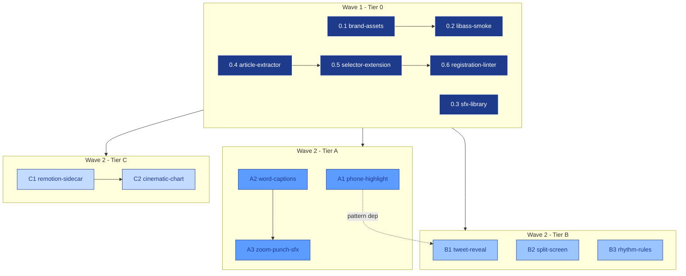

# feat: Engagement Layer v2 — Agent-Team Parallel Execution Plan

## Overview

This is the **execution companion** to `2026-04-18-001-feat-engagement-layer-v2-plan.md`. The origin plan defines **what** to build (12 implementation units across Tier 0/A/B/C). This plan defines **how to build it in parallel** using:

1. Claude Code **Agent Teams** (TeammateTool + Task system) — see `compound-engineering:orchestrating-swarms`.
2. **Git worktrees** — one isolated worktree per in-flight unit (see `superpowers:using-git-worktrees`).
3. **Per-branch subagent discipline** — implementer → spec reviewer → code-quality reviewer loop (see `superpowers:subagent-driven-development`).
4. **Feature-branch fan-out** under a single `feat/engagement-layer-v2` integration branch, with deterministic merge order driven by the origin plan's dependency graph.

The origin plan's tier sequencing already carries most of the dependency structure. This document maps those tiers onto a concrete branch/worktree/team topology, defines the conflict-serialization rules for shared files, and specifies the per-stream agent prompt stack.

**This plan does not restate the origin plan's technical decisions.** When a file path, design decision, or verification criterion is already specified in Unit 0.1 / A1 / B2 / etc., this plan references it rather than duplicating it.

## Problem Frame

The origin plan is large — 12 units, ~60 files created or modified, ~800 lines of specification — and most units are genuinely independent after Tier 0 lands. Executing them serially in one working tree wastes the parallelism the plan was designed around. Two specific bottlenecks:

- **Waiting on sequential checkpoints** between units that could run concurrently (e.g., `phone_highlight` generator, `tweet_reveal` generator, and the Remotion sidecar share no real code dependency).
- **Context pollution**: one long session touching `factory.py`, `selector.py`, `video_editor.py`, the Dockerfile, and 10 test files risks mistakes a fresh subagent per branch would not make.

The existing Claude Code primitives — worktrees, teammates, per-branch subagents — are designed exactly for this. The gap is an orchestration plan that carries the origin plan's dependency structure + project conventions + conflict-serialization rules into a reproducible team run.

## Requirements Trace

This plan inherits and does not alter the origin plan's R1–R8. It adds operational requirements specific to parallel execution:

- **RX1.** Every origin-plan unit runs in its own feature branch + worktree; no two in-flight units share a working tree.
- **RX2.** Dependency order from the origin plan's Tier Sequencing is preserved: Tier 0 → (Tier A ∥ Tier B ∥ Tier C), with intra-Tier-0 sub-ordering `(0.1 → 0.2)`, `(0.4 → 0.5 → 0.6)`, and `(C1 → C2)`.
- **RX3.** Shared-file conflicts (enumerated in *Conflict Register* below) are serialized, not merged post-hoc. Two workers never hold simultaneous writes to the same file scope.
- **RX4.** Each per-branch subagent runs the full review loop (spec compliance → code quality → green tests) before its branch is eligible for merge into `feat/engagement-layer-v2`.
- **RX5.** No per-unit branch lands directly on `main`. The integration branch `feat/engagement-layer-v2` is the merge target, and only when all of Tier 0 + chosen tiers land green does it get rolled up.
- **RX6.** Project conventions from `CLAUDE.md` (Python 3.10+, dual-import pattern, failure isolation in pipeline steps, secrets-via-env) are carried into every per-branch prompt.
- **RX7.** The memory-recorded "Never cat/head/grep .env files" rule is enforced in every worker prompt.

## Scope Boundaries

- **This plan does not rewrite the origin plan.** Origin units, file paths, design decisions, and verification criteria stand.
- **This plan does not introduce new code dependencies.** Worktrees and the TeammateTool are built-in; no new Python/Node packages.
- **This plan does not prescribe the A/B/C tier rollout order** (origin plan owns that via its *Verification Strategy & Rollout* section). It only guarantees that the agent-team topology can support the chosen order.
- **This plan does not cover post-merge production canary.** Canary + A/B + rollback stay in the origin plan.
- **Teammates only run in-process or tmux backend.** iTerm2 backend is acceptable but not required; the plan works on any of the three.
- **No cross-branch refactoring.** A worker must not touch files outside the Files list of its origin-plan unit. Cross-cutting refactors (e.g., migrating all generators to `scripts/branding.py`) stay opportunistic as the origin plan already states.
- **No auto-merge to `main`.** Rollup PR from `feat/engagement-layer-v2` → `main` is a human-owned gate.

## Context & Research

### Relevant Code and Patterns

- **Origin plan** (`docs/plans/2026-04-18-001-feat-engagement-layer-v2-plan.md`) — the authoritative unit specifications. Treat as the single source of truth for *what* each unit must deliver.
- **Current branch** (`feat/end-to-end-pipeline`) — has in-flight working changes. The integration branch `feat/engagement-layer-v2` must be cut from a clean base after those working changes are either committed, stashed, or branched separately.
- **Project skills**:
  - `cc-dispatch-unit` (`.claude/skills/cc-dispatch-unit/SKILL.md`) — already encodes project conventions, learnings references, dual-import pattern, failure isolation, and the "no real API calls from tests" rule. Each per-branch worker prompt derives from this template.
  - `cc-test`, `cc-safe-commit` — project-local test and commit helpers; workers use these, not raw pytest/git, where applicable.
  - `cc-deploy-portainer` — referenced in memory for production; out of scope until rollup.

### Institutional Learnings (from `docs/solutions/`)

- `docs/solutions/integration-issues/haiku-drops-version-number-periods-*.md` — LLM structured-output discipline. Carried into A3 (`keyword_extractor`) and B1 (tweet-detection Haiku call).
- `docs/solutions/integration-issues/avatar-lip-sync-desync-across-segments-*.md` — "trimmed-audio clock is the single master" — already surfaced as a Tier 0 invariant in the origin plan.
- `docs/solutions/workflow-issues/` — workflow patterns referenced as applicable per unit.

### Skills Architecture (load-bearing references)

| Skill | Role in this plan |
|---|---|
| `compound-engineering:orchestrating-swarms` | Team creation, task list with dependencies, inbox-based coordination. This is the **Agent Teams feature**. |
| `superpowers:using-git-worktrees` | Per-unit worktree creation with `.worktrees/` convention, `.gitignore` safety check, clean-baseline test verification. |
| `superpowers:subagent-driven-development` | Per-worktree loop: implementer → spec reviewer → code-quality reviewer → mark task complete. |
| `superpowers:dispatching-parallel-agents` | Wave-level parallel fan-out of independent workers in a single message (concurrent Task calls). |
| `superpowers:test-driven-development` | Each worker writes unit tests before code where the Execution note calls for test-first (A2, A3, C2). |
| `superpowers:verification-before-completion` | Gate before a branch is declared merge-eligible. |
| `superpowers:finishing-a-development-branch` | Per-branch wrap-up: final review, squash/rebase decision, merge into integration. |
| `cc-dispatch-unit` (project-local) | The project's dispatch template; its "Project conventions (MUST follow)" block is embedded verbatim in every worker prompt. |
| `cc-test`, `cc-safe-commit` | Project test + commit helpers; referenced in worker prompts. |
| `compound-engineering:git-commit-push-pr` | Integration-branch → main rollup PR. |
| `compound-engineering:git-clean-gone-branches` | Post-merge cleanup. |

## Key Technical Decisions

- **Branch topology = one integration branch + one per-unit branch.** `feat/engagement-layer-v2` is the integration branch; `feat/engage-v2/<unit-id>` are the per-unit branches (e.g., `feat/engage-v2/0.1-brand-assets`, `feat/engage-v2/a1-phone-highlight`). No direct merges to `main` until rollup.
  - Rationale: one integration branch lets us run full-suite regression tests after each unit merge without touching `main`; per-unit branches keep blast radius small and PR diffs reviewable.
  - Rejected alternative: trunk-based development into `main` directly. Too risky for a 12-unit cross-cutting change; one bad merge blocks all downstream work.
  - Rejected alternative: long-lived `develop` branch. Over-engineered for a ~3-week execution window; the integration branch is the equivalent, and disappears at rollup.

- **Worktree directory = `.worktrees/` (project-local, hidden).** Matches the default from `superpowers:using-git-worktrees`. Prerequisite: `.worktrees/` must be in `.gitignore` before the first worktree is created (Unit 1 below).
  - Rationale: project-local keeps worktrees discoverable via `git worktree list`; hidden so `ls` stays clean; ignored so accidental `git add -A` never commits a worktree.
  - Rejected alternative: `~/.config/superpowers/worktrees/social_media/`. Out of band from the project; harder for a human operator to locate when switching between worktrees.

- **Team name = `engage-v2-swarm`.** Team is created once at the start of the run; persists until rollup; then `cleanup`.
  - Task list mirrors the 12 origin-plan units; dependencies in the task list mirror the origin plan's `Dependencies:` field. Task auto-unblocking drives dispatch.

- **Spawn backend = tmux where available, else in-process.** Matches the skill's auto-detection.
  - Rationale: tmux gives the human operator visible panes for each worker, which is the closest analog to "watching 8 feature branches at once." If tmux isn't available, in-process is acceptable (faster, less visibility).

- **Per-branch worker = one `general-purpose` subagent.** Implementation is mechanical once the origin plan's unit spec is passed. Reviewers are separate dispatched subagents, not persistent teammates.
  - Rationale: `subagent-driven-development` is the right primitive per branch. The team structure is for coordination across branches, not for the inner review loop.
  - Rejected alternative: one team per branch (nested teams). Over-engineered; adds inbox noise without coordination benefit.

- **Reviewer roles = two-stage per branch, dispatched on completion.**
  - Stage 1: **Spec reviewer** — `compound-engineering:review:pattern-recognition-specialist` or `general-purpose` with the origin plan's unit spec as the reference. Confirms the code matches the spec (no under- or over-building).
  - Stage 2: **Code quality reviewer** — `compound-engineering:review:kieran-python-reviewer` for Python units, `compound-engineering:review:kieran-typescript-reviewer` for C1/C2 (TypeScript), `compound-engineering:review:architecture-strategist` for units that cross boundaries (0.5, A3).
  - Rationale: the skill defines this two-stage pattern explicitly and it aligns with the plan's *Confidence check (planner self-review)* in the origin plan.

- **Merge strategy into integration branch = rebase + fast-forward.** Each per-unit branch is rebased onto the latest `feat/engagement-layer-v2` immediately before merge; then fast-forward merged. No merge commits inside the integration branch.
  - Rationale: keeps the history of the integration branch linear, which simplifies the integration→main rollup PR.
  - Rejected alternative: squash merges. Loses the per-unit commit granularity that helps debugging if a downstream unit reveals a regression in an earlier unit.

- **Gate between waves = full test suite green on integration branch + all new units' verification outcomes met.** Wave 1 = Tier 0 (0.1–0.6). Wave 2 = Tier A ∥ Tier B ∥ Tier C. Wave 2 only starts after Wave 1 is green.
  - No further wave structure; A1/A2/A3/B1/B2/B3/C1/C2 in Wave 2 all rebase on the post-Wave-1 integration branch and run in parallel with the intra-tier ordering from the origin plan (A2→A3, A1→B1, C1→C2).

- **Per-branch CI = run the same `pytest` slice the origin plan specifies in that unit's *Verification* block, plus the project-wide regression slice from `cc-dispatch-unit`.** No worker declares DONE without the verification block passing.
  - Worker prompts explicitly list which test paths to run; this is copy-pasted from each origin-plan unit's *Verification* bullets.

- **Conflict register = serialization + region-scoped edits.** For files touched by multiple units (enumerated in *Conflict Register* below), each worker's diff is scoped to a specific region of the file (documented per unit); downstream workers rebase and apply a region-scoped patch. Workers never touch regions outside their assigned scope.

- **Failure isolation = a failed or blocked unit stops its own branch, not the wave.** Other workers in the same wave continue. The orchestrator marks the task `pending` and either re-dispatches with more context (per `subagent-driven-development`'s BLOCKED handling) or escalates to the human.

- **Human-in-the-loop = rollup PR.** Integration → main is a human-reviewed PR, not auto-merged. This is the single manual step.

## Open Questions

### Resolved During Planning

- **Worktree directory** — resolved to `.worktrees/` (hidden, project-local). Requires `.gitignore` update before first worktree creation (Unit 1).
- **Team lifetime** — one team (`engage-v2-swarm`) for the full run, not one team per wave. Reduces bootstrap cost; the task system already distinguishes waves via dependencies.
- **Reviewer model selection** — two-stage per branch, using the specialized code-review personas from `compound-engineering:review:*` rather than `general-purpose` reviewers, because this codebase's CLAUDE.md conventions and dual-import pattern are exactly what those specialists are tuned for.
- **Merge order for intra-Tier-0 parallelism** — 0.1, 0.3, 0.4 fan out first (independent), then 0.2 after 0.1, 0.5 after 0.4, 0.6 after 0.5. Mirrors the origin plan's Dependencies: lines.
- **Shared-file conflict handling** — serialize via merge order + region-scoped edits, documented in *Conflict Register*. No "merge-resolver" worker needed.
- **Per-branch test scope** — exactly the test paths listed in each origin-plan unit's *Verification* block, plus the project regression slice `python3 -m pytest scripts/thumbnail_gen/tests/ scripts/video_edit/tests/ scripts/posting/tests/ -q` from `cc-dispatch-unit`.

### Deferred to Implementation

- **tmux session layout** — whether to use nested panes or an external `claude-swarm` session depends on operator preference at dispatch time. Default: let the skill auto-detect.
- **Exact reviewer prompt text per unit** — templates are sketched in *Unit 6* below; final wording gets tuned on first-branch dispatch and reused.
- **Whether A2's fallback path** ("switch to ASS `\p1` drawing primitives if border-as-background reads poorly") is chosen live or deferred to a follow-up branch — depends on the first render inspection; origin plan already flags this as an execution-time decision.
- **Whether B2's `stats_card` 540-px layout needs font auto-scaling** — origin plan flags this; decide during the B2 branch's implementation.
- **Remotion image size budget verification** (Unit C1) — verify at first build; if >1.8 GB, the origin plan's Pillow-fallback becomes a follow-up branch, not a rework of C1.
- **Whether to pre-create all per-unit branches up-front or lazily at dispatch time** — lazy creation preferred (the worktree skill creates the branch at worktree-add time), but the orchestrator may pre-create branches for the Wave-1 fan-out if the team config benefits from pre-registered members.

## High-Level Technical Design

> *This illustrates the intended approach and is directional guidance for review, not implementation specification. The implementing agent should treat it as context, not code to reproduce.*

### Branch & worktree topology

```
main
 └── feat/engagement-layer-v2                  (integration branch, cut from main)
       ├── feat/engage-v2/0.1-brand-assets     ← .worktrees/engage-v2-0.1/
       ├── feat/engage-v2/0.2-libass-smoke     ← .worktrees/engage-v2-0.2/   (after 0.1 merged)
       ├── feat/engage-v2/0.3-sfx-library      ← .worktrees/engage-v2-0.3/
       ├── feat/engage-v2/0.4-article-extractor← .worktrees/engage-v2-0.4/
       ├── feat/engage-v2/0.5-selector-extension ← .worktrees/engage-v2-0.5/ (after 0.4 merged)
       ├── feat/engage-v2/0.6-registration-linter ← .worktrees/engage-v2-0.6/ (after 0.5 merged)
       │
       ├── feat/engage-v2/a1-phone-highlight   ← .worktrees/engage-v2-a1/
       ├── feat/engage-v2/a2-word-captions     ← .worktrees/engage-v2-a2/
       ├── feat/engage-v2/a3-zoom-punch-sfx    ← .worktrees/engage-v2-a3/    (after A2 merged)
       │
       ├── feat/engage-v2/b1-tweet-reveal      ← .worktrees/engage-v2-b1/    (after A1 merged)
       ├── feat/engage-v2/b2-split-screen      ← .worktrees/engage-v2-b2/
       ├── feat/engage-v2/b3-rhythm-rules      ← .worktrees/engage-v2-b3/
       │
       ├── feat/engage-v2/c1-remotion-sidecar  ← .worktrees/engage-v2-c1/
       └── feat/engage-v2/c2-cinematic-chart   ← .worktrees/engage-v2-c2/    (after C1 merged)
```

### Team + task-dependency graph



### Per-branch worker execution loop

```mermaid
sequenceDiagram
    participant L as Leader (orchestrator)
    participant W as Worker (general-purpose)
    participant SR as Spec Reviewer
    participant QR as Code-Quality Reviewer

    L->>W: dispatch with origin-plan unit spec + conventions + worktree path
    W->>W: cd worktree; write tests; implement; run verification tests
    W->>L: DONE / DONE_WITH_CONCERNS / NEEDS_CONTEXT / BLOCKED
    alt DONE or DONE_WITH_CONCERNS (resolved)
        L->>SR: dispatch spec reviewer with unit spec + diff
        SR->>L: spec pass / fail (with gaps)
        alt spec fail
            L->>W: re-dispatch with spec-reviewer feedback
            W->>L: DONE
            L->>SR: re-review
        end
        L->>QR: dispatch code-quality reviewer with diff
        QR->>L: approve / fail (with issues)
        alt quality fail
            L->>W: re-dispatch with code-quality feedback
            W->>L: DONE
            L->>QR: re-review
        end
        L->>L: rebase branch onto integration; fast-forward merge; mark task complete
    else BLOCKED
        L->>L: assess blocker; re-dispatch with more context or escalate
    end
```

## Implementation Units

The implementation units of *this* plan are the scaffolding that enables parallel execution of the origin plan's units. The origin plan's 12 units remain the atomic work items; they are not re-specified here.

---

- [ ] **Unit 1: Repo prerequisites + integration branch**

**Goal:** `.worktrees/` safely ignored, integration branch created from a clean base, progress-tracker doc in place.

**Requirements:** RX1, RX5.

**Dependencies:** None (this is the first unit).

**Files:**
- Modify: `.gitignore` (append `.worktrees/` if not already ignored)
- Create: `docs/plans/2026-04-18-002-engage-v2-progress.md` (progress tracker — checkbox grid mirroring origin plan units, owner field, branch field, merge-state field)
- Git: create branch `feat/engagement-layer-v2` from `main` (or from the agreed clean base if `feat/end-to-end-pipeline` is merged first)

**Approach:**
- Verify `.worktrees/` is actually ignored with `git check-ignore` before the first worktree creation (per `superpowers:using-git-worktrees`).
- The progress tracker doc is the orchestrator's dashboard: for each of the 12 origin-plan units, one row with columns `[ ] | unit | branch | worktree | owner | status | merged-at`. Human-readable markdown table.
- The integration branch is cut once; workers rebase onto it as it advances.

**Patterns to follow:**
- `superpowers:using-git-worktrees` — directory selection + ignore verification.
- `docs/plans/` naming convention (`YYYY-MM-DD-NNN-<type>-<slug>-plan.md` already established).

**Verification:**
- `git check-ignore -v .worktrees/dummy` returns a match.
- `feat/engagement-layer-v2` exists and tracks the correct base commit.
- Progress tracker file exists with all 12 origin-plan units listed.

**Execution note:** Orchestrator performs this directly (not a dispatched subagent); it's a one-time setup step.

---

- [ ] **Unit 2: Stream manifest**

**Goal:** One machine-readable manifest that maps each origin-plan unit to its branch, worktree path, dependencies, touched files, and review-specialist selection. This becomes the orchestrator's dispatch table.

**Requirements:** RX1, RX2, RX3.

**Dependencies:** Unit 1.

**Files:**
- Create: `docs/plans/2026-04-18-002-engage-v2-stream-manifest.yaml`

**Approach:**
- YAML document with one entry per origin-plan unit. Shape per entry:
  - `unit_id` (e.g., `0.1`, `a1`, `c2`)
  - `origin_plan_ref` (section heading in the origin plan)
  - `branch` (e.g., `feat/engage-v2/0.1-brand-assets`)
  - `worktree` (e.g., `.worktrees/engage-v2-0.1`)
  - `depends_on` (list of unit_ids — mirrors origin-plan Dependencies)
  - `wave` (`1` or `2`)
  - `touched_files` (list — mirrors origin-plan Files section)
  - `shared_files` (subset of `touched_files` also touched by other units — triggers conflict register)
  - `test_paths` (list — mirrors origin-plan Verification bullets)
  - `code_quality_reviewer` (`kieran-python-reviewer` | `kieran-typescript-reviewer` | `architecture-strategist`)
  - `execution_note` (from the origin plan if present; e.g., "test-first for A2/A3/C2")
- Values are extracted from the origin plan by reading it, not re-invented.

**Patterns to follow:**
- `cc-dispatch-unit` skill — its "Read the plan file, extract unit spec" pattern informs how the manifest encodes per-unit context.

**Verification:**
- All 12 origin-plan units are present in the manifest.
- Every `depends_on` entry refers to a unit_id that exists in the manifest.
- Every `test_paths` entry matches what the origin plan lists under that unit's *Verification*.

---

- [ ] **Unit 3: Conflict register**

**Goal:** Enumerate files touched by multiple origin-plan units, define the serialization order for writes to each, and scope each unit's diff to a non-overlapping region of the file.

**Requirements:** RX3.

**Dependencies:** Unit 2.

**Files:**
- Create: `docs/plans/2026-04-18-002-engage-v2-conflict-register.md`

**Approach:**

Shared files identified from the origin plan:

| File | Units that touch it | Serialization rule |
|------|---------------------|--------------------|
| `.gitignore` | 1 | Only Unit 1 writes; all later units leave it alone. |
| `sidecar/Dockerfile` | 0.1, 0.2 | 0.1 adds fonts/fc-cache block; 0.2 adds libass-check RUN block immediately after the ffmpeg install line. 0.2 rebases onto 0.1 before touching the file. |
| `sidecar/requirements.txt` | 0.4 | Only 0.4 edits. |
| `requirements.txt` (repo root) | 0.4 | Only 0.4 edits (mirror of sidecar/requirements.txt line). |
| `scripts/commoncreed_pipeline.py` | 0.4, 0.5, A3 | 0.4 adds `extracted_article` step in `_run_topic`; 0.5 extends `VideoJob` dataclass + registry import; A3 adds `keyword_punches` extraction between transcribe and assemble. Each worker adds a discrete, non-overlapping block; order of landing: 0.4 → 0.5 → A3. |
| `scripts/smoke_e2e.py` | 0.4, 0.5, A3 | Mirror of commoncreed_pipeline.py. Same order; same discrete-block rule. |
| `scripts/broll_gen/selector.py` | 0.5, B3 | 0.5 extends `_VALID_TYPES` + schema + short-circuit fix + `_SYSTEM_PROMPT` additions; B3 appends to `_TIMELINE_SYSTEM_PROMPT` (lives in `browser_visit.py`, not `selector.py` — **correction: B3 edits `browser_visit.py`, not `selector.py`**; no conflict with 0.5). |
| `scripts/broll_gen/factory.py` | 0.5, A1, B1, B2, C2 | 0.5 adds placeholder branches for the four new types; A1/B1/B2/C2 each replaces its own placeholder with the real generator. Each unit touches exactly one `if type_name == "<its type>"` branch. Serialization order: 0.5 first (sets scaffolding), then A1/B1/B2/C2 in any order (non-overlapping branches). |
| `scripts/broll_gen/browser_visit.py` | B2, B3 | B2 adds `width_override` param; B3 edits `_TIMELINE_SYSTEM_PROMPT` + `_plan_timeline`. Different functions; land in either order. |
| `scripts/broll_gen/headline_burst.py` | 0.1, B2 | 0.1 migrates to `scripts/branding.py`; B2 adds `width_override`. 0.1 lands first (structural migration); B2 rebases and adds its param. |
| `scripts/broll_gen/image_montage.py`, `stats_card.py` | B2 only | Only B2 edits. |
| `scripts/video_edit/video_editor.py` | A2, A3 | A2 replaces `_build_ass_captions`; A3 replaces `_write_with_captions` call site with `_apply_engagement_pass`. Different functions; land A2 → A3 so A3's integration includes A2's ASS output. |
| `deploy/portainer/docker-compose.yml` | C1 | Only C1 edits (adds `commoncreed_remotion` service). 0.3 only verifies `assets/` mount; no edit expected. |
| `scripts/news_sourcer.py` (or wherever topic-selection Haiku lives) | B1, B2 | B1 adds `tweet_quote` to Haiku output; B2 adds `split_screen_pair`. Separate JSON-schema fields; land in either order. |

**Region-scoped edit rule:** every worker's diff is bounded to the file regions enumerated in the origin-plan unit's *Files* + *Approach* sections. If a worker's diff strays outside its region, the spec reviewer fails the unit.

**Patterns to follow:**
- Origin plan's *Key Technical Decisions → "Both `smoke_e2e.py` and `commoncreed_pipeline.py` updated for every pipeline-flow change."*
- Origin plan's *Key Technical Decisions → "Stdout contract preserved" (additive only).*

**Verification:**
- Every shared file in the register has a serialization rule.
- Every origin-plan unit's Files list is cross-referenced against the register; any shared file has a known rule.

---

- [ ] **Unit 4: Per-branch worker prompt template**

**Goal:** One standardized prompt template that every per-branch worker receives. Combines the origin-plan unit spec, project conventions from `cc-dispatch-unit`, worktree path, branch name, and verification test paths.

**Requirements:** RX4, RX6, RX7.

**Dependencies:** Unit 2, Unit 3.

**Files:**
- Create: `docs/plans/2026-04-18-002-engage-v2-worker-prompt.md`

**Approach:**

The template has four required blocks:

1. **Role framing** — "You are implementing ONE unit of the Engagement Layer v2 origin plan. Your worktree: `<path>`. Your branch: `<branch>`. Do not touch any branch but yours."

2. **Unit spec** — extracted from the origin plan for this unit_id:
   - Goal, Requirements (R1–R8), Dependencies, Files (create/modify/test), Approach bullets, Execution note (if present), Patterns to follow, Test scenarios, Verification.
   - Plus the *Conflict Register* entries for every shared file this unit touches — the worker sees its serialization rule and region scope before writing any code.

3. **Project conventions** — copied verbatim from `.claude/skills/cc-dispatch-unit/SKILL.md` "Project conventions (MUST follow)" block. Includes: Python 3.10+ compatibility, dual-import pattern, failure isolation pattern (reference `scripts/thumbnail_gen/step.py`), no real API calls from tests, CommonCreed brand palette, "never cat/head/grep .env files" rule.

4. **Deliverable contract** — the worker returns one of four statuses (DONE, DONE_WITH_CONCERNS, NEEDS_CONTEXT, BLOCKED) per `superpowers:subagent-driven-development`. On DONE, the worker has:
   - Implemented the unit's Files list exactly
   - Written and run the tests from the Verification block (all green)
   - Run the project regression slice (`python3 -m pytest scripts/thumbnail_gen/tests/ scripts/video_edit/tests/ scripts/posting/tests/ -q`)
   - Committed on its branch but not pushed
   - Reported structured output: files changed, test results, decisions made on deferred questions, any scope creep rejected, verification outcomes line-by-line

**Patterns to follow:**
- `cc-dispatch-unit` skill's dispatched-prompt template (section "How to run this skill → step 5").
- `superpowers:subagent-driven-development`'s implementer-prompt.md convention.

**Verification:**
- Template has all four blocks and no unfilled placeholder tokens when rendered against the stream manifest's Unit 0.1 entry.
- Rendering the template for Unit 0.1 and Unit C1 (TypeScript) produces two structurally parallel prompts that differ only in unit-specific fields and the code-quality reviewer selection.
- A dry-run dispatch using the Unit-0.1 rendered prompt returns a structured status (DONE / DONE_WITH_CONCERNS / NEEDS_CONTEXT / BLOCKED) in the `subagent-driven-development` shape, without the orchestrator having to re-prompt for missing context.
- Every project-convention line from `cc-dispatch-unit` appears verbatim in the rendered prompt — `grep`-diff check against the skill source.

---

- [ ] **Unit 5: Reviewer prompt templates (spec + code-quality)**

**Goal:** Two reviewer-prompt templates used by the orchestrator after each worker returns DONE. Spec reviewer confirms code matches origin-plan unit spec; code-quality reviewer approves the implementation.

**Requirements:** RX4.

**Dependencies:** Unit 4.

**Files:**
- Create: `docs/plans/2026-04-18-002-engage-v2-spec-reviewer-prompt.md`
- Create: `docs/plans/2026-04-18-002-engage-v2-code-quality-reviewer-prompt.md`

**Approach:**

**Spec reviewer prompt** inputs:
- The origin-plan unit's Goal, Files, Approach, Test scenarios, Verification.
- The git diff from the worker's branch against `feat/engagement-layer-v2` (HEAD).
- The conflict-register entry for this unit, if any.
- Instruction: confirm the diff matches the spec, no under- or over-building, no files outside the Files list, and conflict-register region scope respected.
- Output: spec-compliant Y/N + bullet list of gaps.

**Code-quality reviewer prompt** inputs:
- The git diff.
- The specialist persona (`kieran-python-reviewer` for Python, `kieran-typescript-reviewer` for C1/C2, `architecture-strategist` for 0.5 and A3).
- Project conventions block (subset of Unit 4's block 3 relevant to code quality — dual-import, failure isolation, secrets, test patterns).
- Instruction: approve or flag issues by severity (Critical / Important / Nit). Critical blocks merge.

**Patterns to follow:**
- `superpowers:subagent-driven-development`'s spec-reviewer-prompt.md and code-quality-reviewer-prompt.md conventions.

**Test scenarios:**
- Spec reviewer with a compliant diff returns pass.
- Spec reviewer with a diff that adds a file outside the Files list returns fail + flags the extra file.
- Code quality reviewer with a diff missing the failure-isolation pattern in a new pipeline step returns fail + flags it.

**Verification:**
- Both templates are self-contained (reviewer does not need to read other plan docs to review one unit).
- Specialist selection per unit_id is deterministic (table in *Unit 2* manifest).

---

- [ ] **Unit 6: Orchestrator runbook**

**Goal:** The leader's step-by-step playbook for driving the full run: team creation, task graph setup, Wave 1 dispatch, per-unit merge, Wave 1 → Wave 2 gate, Wave 2 dispatch, Wave 2 merge, rollup.

**Requirements:** RX1–RX7.

**Dependencies:** Units 1–5.

**Files:**
- Create: `docs/plans/2026-04-18-002-engage-v2-orchestrator-runbook.md`

**Approach:**

Runbook sections:

1. **Bootstrap** — verify prerequisites (Unit 1 done), create team `engage-v2-swarm` via `Teammate({ operation: "spawnTeam", ... })`, create 12 tasks mirroring the stream manifest, set up `addBlockedBy` for intra-Tier-0 dependencies (0.2 blocked by 0.1; 0.5 blocked by 0.4; 0.6 blocked by 0.5; A3 blocked by A2; C2 blocked by C1) and for the Wave-1 → Wave-2 gate (Wave-2 units blocked by all Wave-1 units).

2. **Wave 1 dispatch** — in one message, dispatch three workers in parallel (one Task call each, `run_in_background: true`): 0.1, 0.3, 0.4. Each worker gets the Unit-4 prompt populated for its unit; each first calls `superpowers:using-git-worktrees` to create its worktree; each implements and reports.

3. **Wave 1 per-unit merge protocol** — on each worker's DONE:
   a. Dispatch spec reviewer (Unit 5 template).
   b. On spec pass, dispatch code-quality reviewer (Unit 5 template, specialist from manifest).
   c. On code-quality approve, orchestrator rebases worker's branch onto `feat/engagement-layer-v2` (latest), runs full regression suite one more time in the worktree, fast-forward merges branch, updates progress tracker, marks task complete. Task auto-unblocks downstream (e.g., 0.1 done unblocks 0.2).
   d. Use `superpowers:finishing-a-development-branch` for the branch wrap-up before merge.

4. **Wave 1 completion gate** — after 0.6 merges (last Wave-1 task to complete), run full project test suite on `feat/engagement-layer-v2`. If green, signal Wave 2; if not, escalate to human.

5. **Wave 2 dispatch** — dispatch up to 5 workers in parallel for the independent Wave-2 units: A1, A2, B2, B3, C1. A3 and B1 and C2 are blocked (A3 by A2; B1 by A1 for pattern-reuse; C2 by C1) and will auto-unblock. Each worker creates its worktree off the now-advanced `feat/engagement-layer-v2`.

6. **Wave 2 per-unit merge protocol** — same as Wave 1, plus: before merge, rebase onto the *current* `feat/engagement-layer-v2` (other Wave-2 units may have landed since the worker started) and re-run that unit's verification tests.

7. **Rollup** — after all 12 tasks complete and `feat/engagement-layer-v2` is green end-to-end, orchestrator runs `compound-engineering:git-commit-push-pr` to open a PR `feat/engagement-layer-v2` → `main`. Human reviews and merges. No auto-merge.

8. **Cleanup** — `compound-engineering:git-clean-gone-branches` removes the 12 per-unit branches after rollup; orchestrator calls `Teammate({ operation: "cleanup" })` for the team; worktrees removed via `git worktree remove` per branch; progress tracker marked fully complete and archived.

**Failure handling:**
- BLOCKED worker → orchestrator assesses: context gap (provide more, re-dispatch same worker), reasoning gap (re-dispatch with more capable model, per `subagent-driven-development`), wrong plan (escalate to human), too large (split — but origin-plan units are already sized, so this is rare).
- Spec or code-quality reviewer failure → implementer (same worker) fixes, reviewer re-reviews, loop until approved.
- Regression failure on integration branch after merge → revert that unit's merge, mark the unit back to `pending` with the failure log, escalate to human before proceeding.

**Patterns to follow:**
- `compound-engineering:orchestrating-swarms` — Pattern 2 (Pipeline with dependencies) + Pattern 6 (Coordinated multi-file refactoring) combined.
- `superpowers:subagent-driven-development` — inner-loop per branch.
- `superpowers:dispatching-parallel-agents` — Wave-1 and Wave-2 fan-out (multiple Task calls in one message).

**Verification:**
- A fresh orchestrator session, given only this plan file and the origin plan, can execute the runbook top-to-bottom without inventing a missing step or guessing at a tool name.
- Every runbook step names the exact tool or skill that implements it (`Teammate({ operation: ... })`, `TaskCreate`/`TaskUpdate`, `Task({ subagent_type: ... })`, skill names with colon-qualified slugs).
- The task-graph section lists all 12 origin-plan unit_ids, each with an explicit `addBlockedBy` instruction; no unit is implicitly blocked.
- Failure-handling section covers all four `subagent-driven-development` statuses (DONE / DONE_WITH_CONCERNS / NEEDS_CONTEXT / BLOCKED) plus the 5-minute heartbeat-timeout recovery path from `orchestrating-swarms`.
- The rollup step references `compound-engineering:git-commit-push-pr` with a PR body template that links origin plan, this plan, manifest, and progress tracker — not a free-form "open a PR".

---

- [ ] **Unit 7: Integration-branch gate checklist**

**Goal:** Machine-readable checklist of what must be green on `feat/engagement-layer-v2` between waves and before rollup.

**Requirements:** RX4, RX5.

**Dependencies:** Unit 2.

**Files:**
- Create: `docs/plans/2026-04-18-002-engage-v2-integration-gates.md`

**Approach:**

Gate 1 — after Wave 1:
- All Tier-0 units' verification tests green (pytest paths enumerated per unit).
- Project regression slice green.
- Container build succeeds with libass + Inter font assertions (Dockerfile builds).
- Three-file registration linter (Unit 0.6) passes.
- `commoncreed_pipeline.py` smoke run (no real API calls) progresses past topic step without exception — confirms 0.4 integration didn't break the flow.
- Stdout contract for `smoke_e2e.py` final `print(...)` block unchanged (additive-only; existing keys still present).

Gate 2 — after Wave 2:
- All Wave-2 units' verification tests green.
- One render smoke per new b-roll generator (phone_highlight, tweet_reveal, split_screen, cinematic_chart) produces an output MP4 (may require manual inspection per origin-plan *Verification*).
- Remotion container builds and passes its /healthz.
- No regression on Wave-1 tests.

Gate 3 — rollup readiness:
- All 12 progress-tracker rows marked merged.
- Integration branch clean: no merge commits from rebase violations, no unsigned commits, no WIP.
- CHANGELOG entry drafted (recommended; not blocking).

**Patterns to follow:**
- Origin plan's *Verification Strategy & Rollout → Per-tier acceptance gates* table.

**Verification:**
- Each gate item is a concrete runnable check (test command or observable outcome), not a vibe.

---

- [ ] **Unit 8: Rollout + cleanup runbook**

**Goal:** Documented procedure for rolling up the integration branch into `main` and cleaning up team/branches/worktrees.

**Requirements:** RX5.

**Dependencies:** Unit 6, Unit 7.

**Files:**
- Create: `docs/plans/2026-04-18-002-engage-v2-rollout-runbook.md`

**Approach:**

1. **Confirm Gate 3** (Unit 7) — all items checked.
2. **Open rollup PR** — `compound-engineering:git-commit-push-pr` creates `feat/engagement-layer-v2` → `main` PR. PR body links the origin plan, this execution plan, the stream manifest, and the progress tracker.
3. **Human review** — owner reviews the aggregated diff, confirms canary / rollout plan from origin plan is ready, approves.
4. **Merge to main** — standard PR merge. Origin plan's production-rollout gates (Tier A 3-day canary, Tier B opt-in 1-week, Tier C opt-in 2-week) begin from main.
5. **Post-merge cleanup**:
   - `compound-engineering:git-clean-gone-branches` prunes the 12 per-unit branches.
   - `git worktree remove .worktrees/engage-v2-<id>` for each worktree.
   - `Teammate({ operation: "cleanup" })` removes the team config.
   - Progress tracker doc gets a `status: archived` frontmatter update.

**Patterns to follow:**
- Existing CommonCreed deploy stack — `cc-deploy-portainer` skill drives the production rollout after merge (out of scope here, referenced for context).

**Verification:**
- After rollout runbook runs, `git branch | grep engage-v2` returns nothing.
- `git worktree list` shows only `main`.
- `~/.claude/teams/engage-v2-swarm/` does not exist.
- Progress tracker archived.

---

## System-Wide Impact

- **Interaction graph:** This plan touches the *execution* surface, not the *code* surface. The only code change it mandates is `.gitignore` (Unit 1). Everything else is docs + orchestration state.
- **Error propagation:** A worker failure stays in its own branch; it does not pollute the integration branch (nothing is merged until reviewers approve and tests are green). A regression discovered after merge is handled by reverting that unit's merge commit, not by patching on top.
- **State lifecycle risks:**
  - **Worktree clutter** — if the run is interrupted, `.worktrees/engage-v2-*` may linger. Mitigated by: per-worktree naming scheme; `finishing-a-development-branch` cleanup per branch; explicit cleanup unit at the end.
  - **Team-config drift** — orphaned `~/.claude/teams/engage-v2-swarm/` if cleanup is skipped. Mitigated by: rollout runbook explicit cleanup step.
  - **Progress-tracker drift** — if the orchestrator forgets to update the tracker, downstream dispatch may re-run a merged unit. Mitigated by: orchestrator's per-merge update step in Unit 6 runbook.
- **API surface parity:** None — the origin plan owns all code-level API surface.
- **Integration coverage:** The Wave-1 completion gate (Unit 7) explicitly runs the full project test suite + smoke runs before Wave 2 opens, catching integration-level breakage that per-branch tests miss.

## Risks & Dependencies

- **Risk — Shared-file merge conflicts bypass the conflict register.** *Mitigation:* spec reviewer verifies region-scoped edit rule on every DONE; if a diff touches a file region outside the unit's scope, it's sent back. Conflict register (Unit 3) is the authoritative reference.
- **Risk — tmux unavailable on the operator's machine.** *Mitigation:* plan works in in-process mode per `orchestrating-swarms` auto-detect; only cost is loss of visibility into background workers. Teammates communicate via inbox files which remain readable.
- **Risk — Worker context explosion on complex units (e.g., A1, C1).** *Mitigation:* cc-dispatch-unit's prompt pattern keeps context focused; worker reads the origin plan only for its assigned unit; project conventions are copied inline, not referenced by path.
- **Risk — Integration branch drifts from `main` during the run.** *Mitigation:* if run exceeds ~2 weeks, orchestrator rebases `feat/engagement-layer-v2` onto `main` at Wave-1 → Wave-2 gate; all in-flight Wave-2 workers then rebase their branches onto the updated integration branch.
- **Risk — Reviewer false-positives delay merge.** *Mitigation:* reviewer prompts (Unit 5) specify severity tiers; Nit-level issues are informational, not blocking.
- **Risk — Memory rule violations (e.g., a worker cats a .env file).** *Mitigation:* rule is restated verbatim in every worker prompt; code-quality reviewer flags any `cat` / `head` / `grep` against `.env*` in the diff as Critical.
- **Risk — Origin plan is amended mid-run.** *Mitigation:* progress tracker records the origin plan's commit SHA at Unit-1 time; if the origin plan changes, the orchestrator surfaces a reconciliation step before continuing.
- **Dependency — Origin plan is frozen for the duration of the run.** No scope changes accepted; new requirements land as a follow-up plan.
- **Dependency — `feat/end-to-end-pipeline` uncommitted changes are handled before cutting `feat/engagement-layer-v2`.** Owner decides: commit, stash-to-separate-branch, or branch-from-current-HEAD. Unit 1 does not auto-resolve this.

## Documentation / Operational Notes

- **Progress-tracker file** lives at `docs/plans/2026-04-18-002-engage-v2-progress.md` and is the canonical dashboard during the run.
- **Stream manifest + conflict register** are read-only during the run; updates require a plan-amendment commit.
- **Rollout runbook** is the only doc that gets executed after rollup; the rest are archival.
- **Monitoring during the run:**
  - `git worktree list` shows all active workers' trees.
  - `~/.claude/teams/engage-v2-swarm/config.json` shows all teammates.
  - `cat ~/.claude/teams/engage-v2-swarm/inboxes/team-lead.json | jq '.'` shows incoming worker reports.
  - `TaskList` shows the dependency graph and wave progress.
- **Operator guidance:** if tmux is available, attach to the `claude-swarm` session (or use in-tmux layout) to watch per-worker panes. In-process mode requires reading inbox files for progress.

## Alternative Approaches Considered

- **Single worker, sequential execution.** Simplest; no orchestration overhead. Rejected: defeats the purpose of the request; wastes origin plan's explicit parallelism.
- **Single branch, multiple subagents in disjoint file slices.** Faster merge (no cross-branch merge step). Rejected: worktrees already solve isolation cleanly, and a single-branch swarm risks silent cross-file interference that per-branch diffs would have surfaced.
- **Per-tier branches (not per-unit).** Fewer branches to manage; tier-level PRs. Rejected: loses intra-tier parallelism (Tier 0 fan-out; A1/A2 concurrent; B1/B2/B3 concurrent; C1 parallel with Tier A).
- **`ce:work` per unit in separate sessions (parallel terminals).** Relies on `superpowers:executing-plans` instead of `subagent-driven-development`. Rejected: the user explicitly asked for Agent Teams + concurrent feature branches from one orchestrator, not multiple human-driven sessions.
- **Task-pool swarm with self-organizing workers** (Pattern 3 from `orchestrating-swarms`). Workers race to claim. Rejected: deterministic order matters because of shared-file serialization; a swarm would need external locking to respect the conflict register.

## Phased Delivery

- **Phase 0: scaffold this plan** — Units 1–8 of *this* plan. One-shot, executed by the orchestrator directly (no sub-team yet).
- **Phase 1: Wave 1 run** — Tier-0 units land on `feat/engagement-layer-v2`.
- **Phase 2: Wave 1 → Wave 2 gate** — full regression + Dockerfile build + linter.
- **Phase 3: Wave 2 run** — Tier A/B/C in parallel.
- **Phase 4: Rollup** — PR to `main`, human merge, cleanup.
- **Phase 5: Production rollout** — owned by the origin plan (Tier A canary, etc.).

## Success Metrics

- **Throughput:** total wall-clock time from Unit 1 complete to Gate 3 green is strictly less than the estimated sum of sequential per-unit time. Target: ≥2× speedup given Wave 1 has 3-wide parallelism and Wave 2 has up to 5-wide.
- **Quality:** zero post-merge reverts on `feat/engagement-layer-v2` during the run; all reviewer failures caught before merge.
- **Hygiene:** at run end, `.worktrees/` empty, no stale branches with `origin: gone`, team config cleaned up.

## Sources & References

- **Origin plan:** [docs/plans/2026-04-18-001-feat-engagement-layer-v2-plan.md](2026-04-18-001-feat-engagement-layer-v2-plan.md)
- **Origin brainstorm:** [docs/brainstorms/2026-04-18-engagement-layer-v2-requirements.md](../brainstorms/2026-04-18-engagement-layer-v2-requirements.md)
- **Load-bearing skills:**
  - `compound-engineering:orchestrating-swarms` — Agent Teams primitive (TeammateTool + Task system)
  - `superpowers:using-git-worktrees` — per-unit workspace isolation
  - `superpowers:subagent-driven-development` — implementer → reviewer(s) loop per branch
  - `superpowers:dispatching-parallel-agents` — wave-level fan-out
  - `superpowers:test-driven-development` — per-unit TDD posture
  - `superpowers:verification-before-completion` — pre-merge gate
  - `superpowers:finishing-a-development-branch` — per-branch wrap-up
  - `.claude/skills/cc-dispatch-unit/SKILL.md` — project-local dispatch conventions
  - `.claude/skills/cc-test/SKILL.md` — project test helpers
  - `.claude/skills/cc-safe-commit/SKILL.md` — project commit helpers
- **Project instructions:** `/Users/vishalan/Documents/Projects/social_media/CLAUDE.md`
- **Memory:**
  - *Posting Layer = Postiz on Ubuntu server* (production-rollout context)
  - *Ubuntu server deployment target* (production-rollout context)
  - *Never cat/head/grep .env files* (carried into every worker prompt)
  - *CommonCreed Brand Palette* (consumed by origin-plan Unit 0.1)
