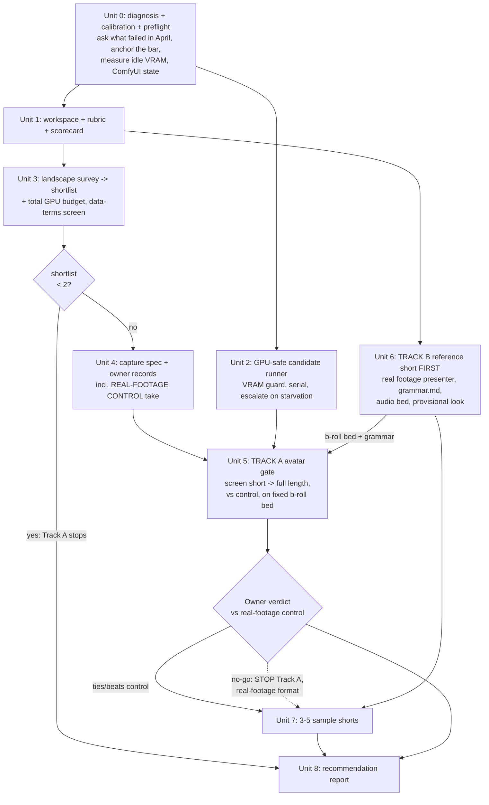

# feat: Avatar Shorts v3 Research Spike

## Overview

A time-boxed research spike that answers one question with evidence, not opinion: **can this server produce a 9:16 short, presented by a photoreal avatar of the owner, that he would publish under his own name?**

The spike is deliberately *not* the build. It ends with 3–5 finished sample shorts, a go/no-go verdict on local photoreal avatar generation, and a stack recommendation report that `/ce:plan` can turn into a production pipeline without redoing model research.

The repo scan changed the shape of this spike materially. Much more exists than the origin document assumed:

- **Voice cloning is already solved and shipped.** `scripts/voiceover/chatterbox_generator.py` runs Chatterbox locally against `/opt/commoncreed/assets/vishalan_voice_ref.wav` (MIT licence, 5–7 GB VRAM, ~18 s per minute of speech). R2 collapses from "research voice cloning" to "validate the existing clone and spot-check whether anything released since April clearly beats it."
- **The layout and caption engine partly exists — with one claim corrected by review.** `scripts/video_edit/video_editor.py` has `_assemble_full_screen`, `_assemble_half_screen`, `_build_ass_captions` (ASS burn-in), `_detect_face_center_y`, and an engagement pass. **But round PIP is not a callable layout:** `_render_circle_pip` is a closure nested inside `_assemble_broll_body`, capturing local state, and `BROLL_BODY` is a *fixed choreography* (hook → b-roll → half-half → … → CTA) that embeds two circular PIP moments and also mixes in half-screen segments — so "split-screen" and "round PIP" are not independently comparable presentations, and BROLL_BODY requires a `broll_path`. Consequences carried into Unit 5: Track A cannot render its third layout without b-roll (a real Track A → Track B dependency), and extracting a reusable PIP layout would be refactoring `video_editor`, which Scope Boundaries forbid. See Unit 5 for how this is handled.
- **B-roll and stat cards are an existing subsystem.** `scripts/broll_gen/` holds 11 registered strategies behind a registry, an LLM selector, and CPU/GPU phase gating; `deploy/remotion/src/templates/` provides NumberTicker / LineChart / BarChart. (`emphasis_card.py` exists on disk but is absent from the registry.) Note: these packages have not changed since 2026-04-21 — they are frozen in the state that produced the rejected April output, so "mature" means "shipped", not "validated".

So the spike's real surface area is narrower and sharper than "rebuild the pipeline": **the avatar itself**, and **the editing grammar that makes 60 seconds worth watching**. Those are exactly the two things that failed the owner's bar in April.

## Problem Frame

The owner wants a new personal channel under his own name and face: 9:16 shorts ≤ 60 s on AI/tech, presented by a photoreal avatar of himself in full-screen, split-screen, or round-PIP, narrated in his cloned voice, with quick cuts, b-roll, and statistics cards.

A prior pipeline (EchoMimic V3 / VEED via fal.ai, with Wan2.2-S2V planned) was wired end to end in Mar–Apr 2026 and **paused on 2026-04-21 because visual quality was below the owner's bar** (see origin: `docs/brainstorms/2026-08-15-vishalan-ai-channel-research-spike-requirements.md`).

**Diagnosis — resolved with the owner on 2026-08-15.** Document review challenged the obvious reading, and the owner's answer corrected both the review and this plan's original framing:

- The black "AVATAR / Work In Progress" clip (`scripts/smoke_e2e.py:340`) was **a deliberate development accelerator**, not a confound in the judged artifact. It let the pipeline be iterated on without waiting for slow avatar generation. Review's inference that the rejected output may never have contained a real avatar is therefore weaker than it appeared — the placeholder existed because avatar generation was *slow and metered*, not because quality was never assessed.
- **The binding constraint was cost and control, not solely realism.** Avatar generation ran through VEED Fabric on fal.ai at **$0.15/sec**. The owner's stated goal now: *"I want to see advancement in open source models which can be deployed on my GPU server."*
- Verified: `scripts/avatar_gen/` unchanged since **2026-04-05**; `scripts/broll_gen/` and `scripts/video_edit/` since **2026-04-21**. Every subsystem is frozen in the state that produced the rejected output — so "already ships" is never evidence of quality anywhere in this plan.

**Why this matters more than a quality post-mortem — the economics gate the format.**

The April pipeline clipped the avatar to hook + CTA only (~6–8 s). The Apr-02 brainstorm presents this as an editorial improvement, but the same requirement notes it "reduces generation cost by ~85-90%". Editorial intent and cost avoidance were conflated, and the cost was doing the real work.

This channel wants the opposite: the avatar *present throughout* a 60 s short, across full-screen, split-screen and round-PIP. On the same metered API:

| Avatar screen time | Per short | 1/day | 3/day |
|---|---:|---:|---:|
| 6–8 s (April's cost workaround) | ~$1 | ~$30/mo | ~$90/mo |
| **~60 s (the format actually wanted)** | **~$9** | **~$270/mo** | **~$810/mo** |

Against the repo's stated $5,000+/month objective, a $270–810/month avatar bill is a structural margin problem. **Local deployment is therefore not a cost optimisation — it is the enabling condition for the format.** April minimised avatar screen time because it could not afford it; the honest question this spike answers is whether open-source models on the 3090 have advanced enough to remove that constraint entirely.

**One question stays open, and the plan does not depend on it.** The owner has not said whether the April visual complaint was the avatar itself or the composition around it. The spike remains diagnosis-agnostic by design: a real-footage control runs through both tracks so the avatar's value is measured rather than assumed, and Track B carries a mandate to *change* composition rather than inventory it. If the composition was the real problem, the spike still lands.

## Requirements Trace

Carried from the origin document.

**Research scope**
- R1. Survey and shortlist local **avatar generation** approaches for the RTX 3090 — image-driven, video/identity-driven, and lip-sync-over-real-footage.
- R2. Survey and shortlist **cloned-voice TTS** — narrowed by repo scan to validating the shipped Chatterbox clone plus a bounded spot-check of newer options.
- R3. Survey current **short-form editing grammar** (hooks, cut cadence, caption styling, transitions), prioritising the last 3–4 weeks.
- R4. Survey **b-roll / a-roll / statistics-card** generation — narrowed by repo scan to gap-filling the existing `broll_gen` subsystem.
- R5. Survey **caption/subtitle generation** with word-level timing accurate enough to publish unedited.
- R6. Research recency: prioritise the last 3–4 weeks; older material only as dated background.
- R7. Reuse prior repo learnings as **inputs**, without letting them bias the shortlist.

**Deliverables**
- R8. A **reference-capture spec** telling the owner exactly what to record.
- R9. **Track A — avatar realism gate**: side-by-side candidate comparison in all three layouts, with a go/no-go verdict.
- R10. **Track B — reference short**: one 45–60 s short demonstrating target hook grammar and cut rhythm.
- R11. **3–5 finished sample shorts** on real recent AI/tech topics.
- R12. A **stack recommendation report** with render time, VRAM, cost, and limitations.
- R13. An **evaluation rubric** applied consistently across candidates.

**Constraints**
- R14. Local-first; any cloud step must be priced per video.
- R15. Spend consent gate — no paid API without explicit owner consent.
- R16. Intelligence layer runs inside the Claude Code harness, not metered API calls.
- R17. ≤ 8 h render per finished 60 s short.
- R18. Must not disturb the running production stack.

**Success criteria — completion and success are different things**

The original criterion ("owner marks ≥ 1 stack publishable") was satisfied by *either* answer, which made the spike unfailable. Split:

**Completion** (the spike ran properly — a process outcome):
- Track A yields an unambiguous, evidence-backed go/no-go with scorecards.
- Recommended stack's render time and VRAM measured on the real server.
- Report is sufficient for `/ce:plan` without redoing model research.

**Success** (the spike found something worth building — a substantive outcome):
- Owner marks ≥ 1 stack "I would publish this under my name."

A **completed-but-unsuccessful** spike is a valid, expected outcome and triggers the decision table below rather than more candidates.

**Decision table — written before the spike runs, so the result selects the branch**

| Spike result | Decision |
|---|---|
| A stack beats or ties the real-footage control, owner marks publishable | **Build v3** → `/ce:plan` on the recommended stack |
| No avatar candidate reaches the control, but a Track B short is publishable with real footage | **Pivot** → build the channel on real footage; avatar shelved, not re-attempted this cycle |
| No short is publishable in any configuration | **Stop** → shelve the personal-channel format; record what would have to change to revisit |
| Shortlist empties at Unit 3, or GPU budget exhausts before Unit 7 | **Stop Track A** → report the constraint as the Track A verdict; Track B still completes |

A no-go **stops Track A**: no additional candidates, no second shortlist, no extended search. That is the point of the gate.

**Time box — ~3 weeks (from origin), now allocated**

| Unit | Allocation | Abort rule |
|---|---|---|
| **U0a GPU bring-up** *(new — see Unit 0)* | **1 day** | NVIDIA driver + CUDA + toolkit, Ollama, ComfyUI/Chatterbox rebuild, ~38 GB weights. If not working by end of day 2, the spike stops and reports an infrastructure blocker rather than proceeding blind |
| U0 diagnosis + preflight | 1 day | Diagnosis done 2026-08-15; remaining work is the post-bring-up VRAM measurement and anchor scoring |
| U1 rubric + scorecard | 1 day | — |
| U2 runner | 1 day | If measured idle VRAM cannot fit the smallest shortlisted candidate, escalate before Unit 5 |
| U3 survey + shortlist | 3 days | Hard stop; ship the shortlist you have |
| U4 capture | 1 day | — |
| U5 Track A gate | 5 days | If no candidate has a scoreable assembled clip by day 3, stop generating and report |
| U6 Track B reference short | 4 days | — |
| U7 sample shorts | 4 days | — |
| U8 report | 1 day | — |

Slack is deliberately thin. When a unit overruns, the abort rules fire rather than the box stretching.

## Scope Boundaries

- **Not building the production pipeline** — no scheduler, Postiz integration, or approval-flow work.
- **Not choosing channel branding** (name, palette, thumbnails).
- **Not training or fine-tuning base models** beyond lightweight identity/voice adaptation (LoRA or voice clone) where a candidate requires it.
- **Not committing to a cloud provider** — cloud appears only as an evaluated, priced alternative.
- **Not producing content for @commoncreed** — this is a separate personal channel.
- **Not refactoring `broll_gen`, `video_editor`, or `chatterbox_generator`** — the spike consumes them as-is and records gaps for the build plan.

## Context & Research

### Relevant Code and Patterns

**Avatar provider pattern (extend this, do not invent a new one)**
- `scripts/avatar_gen/base.py` — `AvatarClient` ABC with `needs_portrait_crop`, `max_duration_s`, `generate()`; raises `AvatarQualityError` for unusable output. Every spike candidate should be wrapped as a subclass so it is comparable and later promotable.
- `scripts/avatar_gen/factory.py` — `make_avatar_client(config)` dispatching on `config["avatar_provider"]`, default `veed`.
- `scripts/avatar_gen/veed_client.py`, `kling_client.py`, `heygen_client.py` — three reference implementations of the interface. **`echomimic_client.py` does NOT subclass `AvatarClient`**: it declares a bare class, duplicates `AvatarQualityError`, omits `needs_portrait_crop` / `max_duration_s`, and uses a different `generate()` signature. It is the only *local* client in the package — i.e. the one precedent shaped like every spike candidate — and it is precisely the one that did not fit the interface.
- `scripts/avatar_gen/layout.py` — `AvatarLayout` enum: `HALF_SCREEN`, `FULL_SCREEN`, `STITCHED`, `SKIPPED`, `BROLL_BODY`.

**Assembly, layouts, captions**
- `scripts/video_edit/video_editor.py` — `VideoEditor.assemble()` plus `_assemble_full_screen`, `_assemble_half_screen`, `_assemble_broll_body`, `_assemble_broll_only`, `_render_circle_pip` (round PIP with easing), `_build_ass_captions` (ASS burn-in with time-varying `_caption_y`), `_detect_face_center_y`, `_build_zoom_expression`, `_apply_engagement_pass`, `trim_silence`.
- Note: the three required layouts map to existing code — **full-screen** → `_assemble_full_screen`, **split-screen** → `_assemble_half_screen`, **round PIP** → `_render_circle_pip` inside `_assemble_broll_body`.

**Voice (already local)**
- `scripts/voiceover/chatterbox_generator.py` — `ChatterboxVoiceGenerator` matching the `VoiceGenerator` interface; provider chosen by `make_voice_generator(config)` in `scripts/voiceover/__init__.py` via `VOICE_PROVIDER`.
- `deploy/chatterbox/server.py` — the containerised TTS service.
- Reference clip: `/opt/commoncreed/assets/vishalan_voice_ref.wav`.

**B-roll and stat cards**
- `scripts/broll_gen/registry.py` — `BrollMeta` catalog with `needs_gpu` and `blocked_by_field_missing`; single source of truth for type classification.
- `scripts/broll_gen/selector.py` — LLM-driven `[primary, fallback]` type selection.
- `scripts/broll_gen/factory.py` + strategies: `stats_card`, `cinematic_chart`, `split_screen`, `code_walkthrough`, `tweet_reveal`, `headline_burst`, `image_montage`, `browser_visit`, `phone_highlight`, `stock_video`, `ai_video`.
- `deploy/remotion/src/templates/` — `NumberTicker.tsx`, `LineChart.tsx`, `BarChart.tsx`.
- `scripts/still_gen/local_flux_client.py` — local FLUX image generation.

**ComfyUI workflows**
- `comfyui_workflows/echomimic_v3_avatar.json`, `flux_still.json`, `depth_parallax.json`, `short_video_wan21.json`, `broll_generator.json`.

**Topics, orchestration, review surface**
- `sidecar/topic_sources/` — HN, GitHub trending, HuggingFace, arXiv, Lobsters (sample-topic supply for R11).
- `sidecar/telegram_bot.py` — existing preview/approval surface, reusable for owner verdicts.
- `scripts/gpu/pod_manager.py` — GPU lifecycle precedent.

**Test conventions**
- Per-package `tests/` directories (`scripts/*/tests/`, `sidecar/tests/`). A new package under `scripts/` follows **`scripts/pytest.ini`** (`pythonpath = .`, `asyncio_mode = auto`, bare imports like `from avatar_gen.layout import ...`), not `sidecar/pytest.ini`. `scripts/avatar_gen/test_avatar_clients.py` shows the provider-test shape — note `avatar_gen` is the exception that keeps tests at package root rather than in `tests/`.

**Workspace**
- `assets/spike/` already exists and is the natural home for spike inputs; `assets/input_media/` and `assets/output_media/` for captured and produced media.

### Institutional Learnings

- **`docs/solutions/integration-issues/avatar-lip-sync-desync-across-segments-2026-04-05.md`** — the single most important input. Lip sync was perfect in isolation but drifted 1–3 s per segment in assembly. Three independent causes: audio duration read from a word-count fallback because `mutagen` was missing; MP3 `-c copy` cuts adding ~26 ms per segment (fixed by cutting WAV then re-encoding); and MoviePy `concatenate_videoclips` drifting at joins. Also: VEED needed ~1 s lip-sync warm-up after each audio jump, and auto-trimmed clips whose audio ended in silence. **Consequence for this spike:** sync must be measured *after assembly*, per segment, not judged on isolated candidate clips — otherwise the gate will pass a candidate that fails in the finished short, which is close to what happened in April.
- **`docs/solutions/integration-issues/local-voice-gen-chatterbox-2026-04-18.md`** — Chatterbox beats ElevenLabs in ~64 % of blind A/B tests, needs 10–30 s of reference audio, ~18 s per minute on the 3090. Reference prep: extract WAV → isolate vocals with demucs → trim 30 s mono. **Post-processing made it worse** (pitch shift + bass EQ produced a "through a tube" sound); raw clone won. Informs the capture spec and warns against "fixing" voice in post.
- **`docs/solutions/workflow-issues/intelligent-broll-type-selection-gpu-phase-gating-2026-03-29.md`** — CPU-first, GPU-gated two-phase architecture; generic AI b-roll disengaged viewers while topic-relevant CPU b-roll performed better. **Consequence:** do not assume "more generative video" improves the short; the reference short should test topic-relevant strategies before reaching for GPU generation.
- **Memory / prior sessions** — frame-accurate lip sync is a hard requirement across segments, and transitions need buffer frames. A ≤ 22 GB peak-VRAM guard applies on the 3090.

### External References

Deliberately not pre-populated. Surveying the Aug 2026 landscape is Unit 3's deliverable (R1, R3, R6), and R7 explicitly warns against letting prior choices bias the shortlist. Fixing a candidate list at plan time would both go stale before execution and prejudge the survey.

## Key Technical Decisions

- **Define a spike-local candidate contract; do NOT force candidates through the production `AvatarClient` ABC.** Review verified the existing contract is cloud-shaped: `generate(audio_url, output_path)` documents its parameter as a *publicly accessible URL*, and every concrete subclass takes a reference **image URL** in its constructor. There is no parameter for local reference media at all. Forcing local candidates through it means either uploading the owner's face and voice to a public host — breaking local-first (R14) and tripping the egress gate — or diverging from the contract, which is exactly what `EchoMimicClient` (the one local client) already did. Worse, two of the three avatar families R1 requires cannot express themselves through it: lip-sync-over-footage needs a driving video, identity-driven models need a reference set. Keeping the ABC would let *interface fit* act as a silent shortlist filter toward the April approach — the opposite of R7. So the spike defines its own protocol taking a local `audio_path`, an optional `driving_video`, and an optional `reference_media` set. Unit 8 records "widen the production ABC for local paths and reference media" as the first build-plan task, and each candidate's promotion cost becomes a scorecard datum rather than an unrecorded exclusion.
- **Judge candidates on assembled shorts against a fixed b-roll bed, not isolated avatar clips.** Directly answers the April failure mode documented in the lip-sync learning, where isolated clips looked perfect and the assembled video did not. Every scored assembly uses the *same* representative b-roll + stat-card bed across all candidates, so avatar↔b-roll colour and lighting clashes surface at the gate rather than in Unit 7 after the shortlist has closed.
- **Include a real-footage control of the owner in the gate.** The highest-value addition from review; it resolves three problems at once. Without it the gate is purely *relative* — a winner means "least bad of 2–4", which is close to the judgment April got wrong. With it: the gate becomes absolute (a candidate that ties real footage is the strongest possible go signal), Track B gets a presenter who is actually the owner rather than a stand-in whose framing and skin tone won't survive substitution, and the never-asked question "why an avatar at all" becomes an empirical result instead of an assumption. Cost: one extra take in a session already scheduled.
- **Tracks are independent in risk, not concurrent in execution.** Review correctly flagged that "parallel tracks" contradicts "strictly serial GPU" — both tracks are GPU-bound on the same 3090, with one operator. The split buys risk decorrelation, not wall-clock compression. **Track B runs first** where they contend: it is cheap, needs no capture session or model downloads, and may answer the channel question before the expensive track is funded. Track A takes GPU priority only once Track B's reference short is rendering.
- ~~**Narrow R2 (voice) to validation**, because the Chatterbox clone is backed by a documented blind A/B result.~~ **SUPERSEDED 2026-08-16 — the justification was wrong.** Unit 3 research traced that "beats ElevenLabs in 64% of blind tests" claim to its source: **8 audio files, 80 listener responses, commissioned and published by Resemble.** Vendor marketing, not independent measurement. Independent blind-vote Elo (Artificial Analysis) actually ranks Chatterbox *below* several open-weights models. **The conclusion — don't switch — survives, but on entirely different grounds: licence filtering.** Nearly everything ranked above Chatterbox is commercially unusable (Fish S2 Pro, Voxtral CC-BY-NC, IndexTTS-2.5 bilibili, OmniVoice weights CC-BY-NC, XTTS defunct). R2 is therefore **re-scoped, not narrowed**: upgrade within the family to Chatterbox Flash (same MIT, same API, ~18 s → 5–7 s per minute of speech), fix the missing `cfg_weight` parameter, and trial one licence-clean challenger (Step Audio EditX, Apache 2.0, +89 Elo, real emotion control). See `docs/spikes/2026-08-avatar-v3/tts-landscape.md`. This is more work than originally allowed and it is justified — Chatterbox's single scalar `exaggeration` knob is a genuine capability gap for hook delivery.
- **R4 (b-roll) is NOT narrowed either** — `broll_gen` has not changed since 2026-04-21 and is frozen in the state that produced the rejected output, so "already ships" is not evidence of quality.
- **Fix configuration before benchmarking anything.** Two verified defects would otherwise corrupt every comparison: caption transcription runs `WhisperModel("base", device="cpu", compute_type="int8")` on a box with an idle 3090, and Chatterbox never passes `cfg_weight` so runs on a library default. Benchmarking tuned challengers against untuned incumbents produces a wrong answer that costs real work to unwind. See `docs/spikes/2026-08-avatar-v3/config-wins.md`.
- **Serial candidate execution under an explicit VRAM ceiling.** The 3090 is shared with the production sidecar and Ollama. Serial execution with a headroom guard is slower than parallel but is the only way to satisfy R18 without a second GPU.
- **Scorecards are structured data, not prose.** A machine-readable scorecard per candidate/clip makes the final report a synthesis rather than a memory exercise, and lets a later re-run compare against this spike's baseline.
- **Owner verdict is qualitative and final.** The rubric (R13) structures attention and makes comparisons repeatable; it does not compute a winner. The success criterion is explicitly "I would publish this under my name" (R11/success criteria), which no metric can stand in for.

## Open Questions

### Resolved During Planning

- *Best local voice-clone quality vs ElevenLabs; how much reference audio is needed?* — Resolved. Chatterbox is shipped and validated (MIT, 5–7 GB VRAM, ~64 % blind-test win over ElevenLabs, 10–30 s reference). R2 becomes validation plus a bounded spot-check of post-April releases.
- *Whether existing Remotion compositions can host the three layouts, or need a fresh template.* — Resolved, with a correction to the origin document's framing: **layouts do not live in Remotion at all.** They live in `scripts/video_edit/video_editor.py` (MoviePy/ffmpeg); Remotion renders stat-card overlays only. All three required layouts already have implementations, including round PIP via `_render_circle_pip`.
- *Local b-roll / stat-card options that fit the render budget.* — Largely resolved. `broll_gen` provides ~12 CPU-first strategies with GPU gating, plus three Remotion stat-card templates and a local FLUX client. R4 narrows to identifying gaps the reference short actually exposes.
- *How to run candidates side by side without disturbing production.* — Resolved by design: serial execution behind a VRAM-headroom guard, spike containers separate from production containers, no changes to running services (Unit 2).
- *Which layouts the spike must cover.* — Full-screen, split-screen, round PIP; mapped to existing assembly functions above.

### Open Product Questions — surfaced by review, NOT resolved here

These are product-level and belong to the owner, not to planning. The plan is structured so it still functions while they are open, but they should be answered before a **go** verdict authorises a build.

- **Why an avatar rather than filming?** Partially answered on 2026-08-15: the driver is scale and control — an avatar lets shorts be produced without a shoot per video, and local deployment removes the per-second API bill that made the format unaffordable. The residual question is throughput: at what posting cadence does that beat simply filming? The spike answers the *quality* half empirically via the real-footage control; the cadence half is still the owner's to state.
- ~~**What is the revenue or strategic thesis?**~~ **Answered 2026-08-15.** Cost elimination is the thesis: the format the owner wants (~60 s of avatar screen time) costs ~$9/short on VEED at $0.15/sec — $270–810/month at 1–3 shorts/day — against a $5,000+/month objective. Local inference reduces marginal cost to electricity. This also reframes success: a local stack that is *merely comparable* to the paid API is already a large win, and does not have to beat it.
- **What posting cadence must this sustain, and does 8 h/short support it?** R17 was inherited, not derived. On a shared 3090, 8 h per 60 s short caps throughput well below typical shorts cadence. Every success criterion can pass and the resulting pipeline still be unable to feed the channel. Unit 8 should report *shorts-per-week achievable*, not only per-short render time.
- **Is any real-viewer signal in scope?** Every gate currently resolves to one person's taste, yet the channel succeeds or fails on watch time. Posting the finished samples to a burner account for 3-second view rate and completion data costs hours and is the only evidence in the spike originating outside the owner's head. Deliberately left out of scope — but it is the cheapest falsification available, and arguably cheaper than three weeks of model research.
- **Does a required AI-disclosure label change the willingness to publish?** The point of a photoreal avatar is that viewers accept it as him; a mandatory "AI-generated" label interacts directly with that. Unit 3 now surveys the platform rules (Security Posture S-h), but whether a label is acceptable is the owner's call.
- **Should @commoncreed's ~97 posts of first-party performance data feed Unit 3?** Scope Boundaries exclude @commoncreed for *publishing*; review notes they silently exclude it for *learning* too, leaving Unit 3 to survey generic internet hook advice while ignoring real results from the same niche and audience.

### Deferred to Implementation

- *Which local avatar approaches are actually viable in Aug 2026, and their VRAM/time envelopes on a 3090.* — This is Unit 3's deliverable; answering it at plan time would go stale and violate R7.
- *Whether any post-April TTS release clearly beats the shipped Chatterbox clone.* — Bounded spot-check in Unit 3; only worth acting on if the margin is obvious.
- *Current retention-tested hook and caption patterns, and which are automatable.* — Unit 3 surveys, Unit 6 tests in practice.
- *Whether ComfyUI needs a fresh container build or model re-downloads after the SSD migration.* — Depends on live server state; discovered in Unit 2.
- *Whether identity adaptation (LoRA) is needed, and how much footage it requires.* — Depends on which candidates survive the Unit 3 shortlist; feeds the capture spec in Unit 4.
- *Exact per-candidate adapter shape (sync vs async, subprocess vs HTTP).* — Emerges from each candidate's real interface.
- *If no local avatar passes the gate, whether a priced cloud avatar step is acceptable for the build.* — An owner decision (R14/R15), triggered only by a Unit 5 no-go and recorded in Unit 8's report.

## High-Level Technical Design

> *This illustrates the intended approach and is directional guidance for review, not implementation specification. The implementing agent should treat it as context, not code to reproduce.*

Two tracks converge into sample shorts and a report. The dashed edge is the escape hatch if the avatar gate fails.



Note the two structural changes review forced: **Track B now precedes Track A** (it supplies the fixed b-roll bed Track A scores against, and is cheap enough to answer the channel question early), and **the no-go edge stops Track A** rather than looping back for more candidates.

Each candidate is adapted to the existing provider interface so the gate compares like with like, and the winner is promotable without a rewrite:

```
AvatarClient (existing ABC)
  ├─ existing: veed / kling / heygen / echomimic
  └─ spike adapters: one thin wrapper per shortlisted candidate
        exposes: needs_portrait_crop, max_duration_s, generate(audio, out)
        records: vram_peak, wall_time, failure mode

CandidateRunner
  for candidate in shortlist:          # serial — never parallel on a shared GPU
      assert vram_headroom_ok()        # abort rather than risk production
      clip = candidate.generate(...)
      for layout in [full, split, pip]:
          short = VideoEditor.assemble(clip, layout, ...)   # real assembly path
          scorecard += measure(short)  # incl. POST-ASSEMBLY per-segment sync
```

## Implementation Units

- [ ] **Unit 0: Diagnosis, calibration, and preflight**

**Goal:** Find out what actually failed in April and what the owner's bar is — *before* anything is produced — and confirm the server can run the spike at all. This is the unit that makes the rest diagnosis-agnostic.

**Requirements:** Precondition for R9, R13; de-risks R1/R4 scoping

**Dependencies:** None. Runs first.

**Files:**
- Create: `docs/spikes/2026-08-avatar-v3/diagnosis.md` (owner's answers, anchor scores, preflight results)

**✅ GPU bring-up COMPLETED 2026-08-15.** The preflight found the stack entirely absent and it has since been restored. Current verified state:

| Component | State |
|---|---|
| NVIDIA driver | ✅ **595.84** (`nvidia-driver-595-open`, Ubuntu-recommended for GA102) |
| Kernel | 6.8.0-137-generic (DKMS built for both 136 and 137) |
| `nvidia-smi` | ✅ RTX 3090, **24576 MiB total** |
| **Idle free VRAM** | ✅ **24111 MiB (~23.5 GB)** — the number every Unit 2 / Unit 5 assumption depends on |
| GPU temp / util at idle | 49 °C / 0 % |
| `nvidia-container-toolkit` | ✅ installed, Docker runtime configured |
| **GPU passthrough into Docker** | ✅ **verified** — `docker run --gpus all` sees the card |
| Production stack after reboot | ✅ all 7 containers healthy |
| **Root disk free** | ✅ **837 GB free of 914 GB (5% used)** |
| HDD `/dev/sda` (~466 GB) | Unmounted, holds the superseded July install. **Not needed** — leave as fallback |

Fix required blacklisting **nouveau**, which had claimed the GPU (`NVRM: GPU 0000:26:00.0 is already bound to nouveau`) and which the driver package did not blacklist automatically. Live unload failed (immediate re-probe), so `/etc/modprobe.d/blacklist-nouveau.conf` + `update-initramfs` + reboot was required. The reboot was clean — Docker on overlay2/SSD, all containers auto-restarted.

**Ollama restored** — v0.32.13, active, GPU detected. Two useful facts for the contention model:
- **Ollama idles at 9 MiB VRAM with no model loaded**, so it only costs memory on demand. The R18 contention picture is materially better than the plan assumed: the previously-feared "Ollama holds a resident model" case is opt-in, not default.
- Its model library is **empty** (models lived on the pre-rebuild install and were not backed up). Production has run 2 weeks without it, so nothing critical depends on it. Pull models only if a spike step actually needs local LLM inference.

**Disk is a non-issue — the earlier constraint was a measurement error.** The pre-reboot reading of "59 GB free" was taken before Ubuntu's boot-time filesystem grow expanded ext4 to fill the full logical volume. Actual state: **914 GB filesystem, 837 GB free, 5% used**, with Docker consuming 26 GB. Consequences:
- **Drop on-disk weight size from Unit 3's filter criteria.** Only VRAM fit and render time constrain candidate selection. A 28 GB unquantised 14B model is not a storage problem.
- **Do not wipe the HDD.** `/dev/sda` stays as-is — an untouched fallback boot volume is worth more than storage that is no longer needed.

**Still deliberately deferred — do NOT pre-download ComfyUI's ~35 GB model set.** The reason is no longer disk pressure but relevance: Unit 3 has not chosen candidates, and pre-pulling April's weights would buy models the shortlist may never use. Bring the *container* up (cheap); fill it once the shortlist names what it needs. ComfyUI is defined in the **Vesper overlay** (`deploy/portainer/docker-compose.vesper.yml`), not the main compose, and joins the same network as `commoncreed_comfyui:8188`.

**Re-measure VRAM after Chatterbox is resident** (it takes 5–7 GB at first `/tts` call). That figure, not the current 23.5 GB, is the real Unit 2 ceiling input.

**Original preflight finding (for the record) — the GPU stack did not exist:**

Measured on the server (`100.72.251.52`, fresh Ubuntu on the RMA replacement SSD):

| Check | State |
|---|---|
| RTX 3090 on PCI bus | ✅ present (`GA102 [GeForce RTX 3090]`) |
| NVIDIA kernel modules | ❌ none loaded |
| NVIDIA / CUDA packages | ❌ none installed |
| `nvidia-container-toolkit` | ❌ not installed |
| Ollama | ❌ inactive |
| ComfyUI image + `commoncreed_comfyui_models` volume | ❌ gone (~35 GB to re-pull) |
| Chatterbox image + `commoncreed_chatterbox_cache` volume | ❌ gone (~3 GB to re-pull) |
| Production stack (Postiz, sidecar, Postgres, Temporal, Redis) | ✅ healthy, up 2 weeks |
| Root disk free | ⚠️ **61 GB** |
| RAM | ✅ 62 GB total, 59 GB available |
| `/opt/commoncreed/assets/vishalan_voice_ref.wav` | ✅ survived (was inside `opt-commoncreed.tar.gz`) |

Cause: the 2026-07-01 rebuild restored `/opt/commoncreed`, Docker data volumes, `/etc` configs and Tailscale from the NAS backup — but NVIDIA drivers are OS-level packages that were never in that backup, and the ComfyUI/Chatterbox **model caches were deliberately excluded as "re-downloadable"**. They now need re-downloading.

**Consequences carried into the plan:**
- Add a **Unit 0a GPU bring-up** task before any spike work: NVIDIA driver + CUDA + `nvidia-container-toolkit`, restore Ollama, rebuild the ComfyUI and Chatterbox containers, re-pull ~38 GB of weights. Budget ~1 day; it is *additional* to the 1 day already allocated to Unit 0.
- **The idle-VRAM measurement is not yet possible** — every Unit 2 and Unit 5 assumption depends on it and stays unmeasurable until the driver is in. Provisional read: with Ollama and Chatterbox currently absent, initial headroom approaches the full 24 GB, so contention is *better* than the plan assumed — but only until they are restored. Re-measure after bring-up, with the production stack running.
- **61 GB free is tight and is now a shortlist constraint.** ComfyUI models ~35 GB + Chatterbox ~3 GB leaves ~23 GB for candidate weights, and a 14B video model can exceed that before quantisation. Unit 3 must treat on-disk weight size as a filter alongside VRAM and render time, or model storage moves to the HDD (`/dev/sda`, currently unused after the SSD migration).

**Approach:**
- **Ask the owner directly what was wrong in April.** *(Done 2026-08-15 — see Problem Frame. The placeholder was a dev accelerator; the binding constraint was per-second API cost and the desire for local deployment. The avatar-vs-composition question remains open and the spike is structured not to depend on it.)* The prior session's own resumption instruction was to ask this before producing anything, and no later unit does. Specific prompts: the phone-mockup b-roll, caption typography, zoom-punch timing, overall composition — and critically, *whether the rejected artifact contained a real avatar or the WIP placeholder* (`scripts/smoke_e2e.py:340`). Five minutes of conversation resolves a P0 that three weeks of rendering cannot.
- **Anchor the bar to observable references.** Score, on the Unit 1 rubric, before any candidate runs: 3–5 published shorts the owner would be proud to have made (the 5s), at least one rejected April artifact (a known-fail datapoint), and — once captured — the real-footage control. Candidate scores are then read *relative to anchors*, so a no-go names a gap instead of a feeling.
- **Preflight the server.** Measure actual idle free VRAM with Ollama and the production stack running; this single number governs every Unit 2 and Unit 5 assumption and is knowable today. Establish ComfyUI state after the SSD migration and whether model volumes need re-downloading (tens of GB). Decide where the spike process runs — on the server or the dev machine — since Chatterbox reachability, ComfyUI access, and GPU telemetry all depend on it.
- **Re-weight the tracks on the answers.** If the owner confirms composition/b-roll was the blocker, Track B becomes the long pole with an explicit mandate to *redesign* (not inventory) the offending strategies, and Track A shrinks to a gate on whether any avatar avoids dragging output down. If he confirms avatar realism, the current weighting stands. Record the decision and its basis.

**Patterns to follow:**
- Dated, source-cited structure of existing `docs/solutions/` entries.

**Test scenarios:**
- *(Diagnostic unit — verified by review.)*
- The diagnosis question is answered in the owner's own words and recorded verbatim, not paraphrased into the plan's existing framing.
- Anchor scorecards exist for at least three reference shorts and one April artifact before Unit 5 runs.
- Measured idle VRAM is recorded as a number, and the smallest plausible candidate is checked against it.
- ComfyUI is confirmed either working or broken-with-an-estimate; "unknown" is not an acceptable exit state.

**Verification:**
- Track weighting for Units 5 and 6 is set by evidence rather than by this plan's assumption.
- No later unit needs to guess what "the bar" means.

---

- [ ] **Unit 1: Spike workspace, evaluation rubric, and scorecard format**

**Goal:** Establish where spike artifacts live and how any candidate gets scored, so every later comparison is consistent and the final report is a synthesis rather than a recollection.

**Requirements:** R13, and the reporting basis for R12

**Dependencies:** None

**Files:**
- Create: `docs/spikes/2026-08-avatar-v3/README.md` (spike charter, time box, current status)
- Create: `docs/spikes/2026-08-avatar-v3/rubric.md` (scoring dimensions and what each score means)
- Create: `scripts/spike/avatar_v3/__init__.py`
- Create: `scripts/spike/avatar_v3/scorecard.py` (scorecard data shape + persistence)
- Create: `scripts/spike/avatar_v3/tests/test_scorecard.py`
- Use: `assets/spike/` for inputs, `assets/output_media/` for produced clips

**Approach:**
- Rubric dimensions start from the origin document (R13) — identity likeness, lip-sync accuracy, motion/body naturalness, layout fit, voice naturalness, hook strength, overall "would I publish this" — and add the craft dimensions that name how a short actually reads as amateur:
  - **Uncanny-valley believability** — eye contact, blink rate, micro-expression, dead-stare. Distinct from identity likeness: a clip can look exactly like the owner and still feel wrong.
  - **Avatar↔b-roll visual coherence** — colour temperature, contrast, grain, lighting direction between the presenter and the footage around them. The classic "pasted on" tell.
  - **Pacing / cut cadence across the full duration** — distinct from hook strength, which only covers seconds 1–3.
  - **Transition and motion quality** — easing, buffer frames at cuts (prior sessions already flag transitions needing buffer frames).
- **Split caption scoring into two dimensions.** They are independent failure modes with different fixes:
  - *Caption timing* — **measured**: word error rate and per-word offset. Says nothing about how it looks.
  - *Caption typographic quality* — **judged**: legibility at phone scale, hierarchy, style coherence, and platform safe-area compliance (TikTok/Reels/Shorts overlay their own chrome over the lower and right frame; captions placed there read as amateur even when the text is perfect).
- Separate **measured** fields (wall time, peak VRAM, post-assembly per-segment sync offset, caption WER) from **judged** fields (the owner's 1–5 scores). Measured fields are populated by the runner; judged fields by the owner. Conflating them is how a spike talks itself into a bad result.
- Record which dimensions apply to Track A (avatar), Track B (grammar), and Unit 7 (whole short), so a no-go verdict names a dimension rather than a feeling.
- Persist one scorecard per candidate × layout × clip, in a format that survives the spike and can be diffed by a future re-run.
- The overall verdict is owner-assigned, never computed from the sub-scores.

**Execution note:** Implement the scorecard shape test-first — it is the contract every later unit writes against, and a late change to it invalidates earlier results.

**Patterns to follow:**
- Package layout and `tests/` placement per `scripts/broll_gen/` and `scripts/still_gen/`.
- `scripts/broll_gen/registry.py` for the "single source of truth, consumed by several callers" shape.

**Test scenarios:**
- A scorecard with only measured fields populated round-trips through persistence without inventing judged values.
- Scorecards for the same candidate across three layouts group correctly for comparison.
- A malformed or partial scorecard (candidate crashed mid-run) is representable and clearly distinguishable from "scored zero".
- Loading scorecards from a previous run does not overwrite or silently merge with the current run.

**Verification:**
- Rubric is stable under re-scoring by the one judge the spike actually has: the owner re-scores a previously scored clip a day later and lands within one point on the judged fields.
- A hand-written example scorecard for a fictional candidate loads, validates, and renders into a comparison view.

---

- [ ] **Unit 2: GPU-safe candidate runner**

**Goal:** Let heavy models run on the shared 3090 without ever putting the production stack at risk, and capture resource telemetry while doing so.

**Requirements:** R14, R17, R18

**Dependencies:** None (can run parallel with Unit 1)

**Files:**
- Create: `scripts/spike/avatar_v3/runner.py` (serial execution, VRAM headroom guard, telemetry capture)
- Create: `scripts/spike/avatar_v3/tests/test_runner.py`
- Reference: `scripts/gpu/pod_manager.py` (GPU lifecycle precedent)
- Reference: `deploy/portainer/docker-compose.yml` (existing GPU service definitions, resource limits)

**Approach:**
- Enforce the ≤ 22 GB peak-VRAM ceiling from prior sessions. On insufficient headroom, **abort the candidate rather than proceed** — a failed spike run is cheap, an OOM that takes down the production sidecar is not.
- **Guard against the guard deadlocking the spike.** With host Ollama holding a resident model plus Chatterbox at 5–7 GB, free VRAM can fall below what any video-avatar candidate needs — at which point every candidate skips, Unit 2 passes its own verification, and the spike produces zero clips while reporting success. Use Unit 0's measured idle-VRAM number as the baseline; define what may be reclaimed (`ollama stop` / `keep_alive=0` is host-level, not a production container, and is permitted); and **escalate after N consecutive headroom skips** so a starved spike surfaces loudly instead of completing silently.
- Strictly serial candidate execution. Parallelism on a single shared GPU is the fastest route to violating R18.
- Record wall time and peak VRAM per generation so R12 and R17 are answered with measurements rather than estimates.
- Treat production containers as read-only: the runner may observe them, never stop, restart, or reconfigure them. ComfyUI availability after the SSD migration is unknown — discover and report, do not silently repair.
- Enforce R15 at this boundary: any candidate whose adapter would incur metered spend must refuse to run without explicit recorded consent. A consent gate that lives only in a human's memory is not a gate.

**Execution note:** Add characterization coverage for the VRAM-guard decision path before wiring any real model behind it — this is the component whose failure mode reaches production.

**Patterns to follow:**
- Failure isolation as practised in `sidecar/caption_gen.py` (never raise out; degrade to a usable result).
- The CPU-first / GPU-gated posture from `intelligent-broll-type-selection-gpu-phase-gating-2026-03-29.md`.

**Test scenarios:**
- Headroom below the ceiling → candidate is skipped and the reason recorded; no generation attempted.
- Candidate crashes mid-generation → partial scorecard persisted, runner proceeds to the next candidate.
- Two candidates queued → they execute strictly one after another, never overlapping.
- A candidate declaring metered spend without recorded consent → refused before any network call.
- Production containers are untouched across a full runner pass (observable before/after state identical).
- Telemetry is captured even when the candidate ultimately fails.

**Verification:**
- A full pass over stub candidates leaves the production stack in an identical state, with per-candidate timing and VRAM recorded.
- Deliberately starving VRAM produces a clean skip with a logged reason, not an OOM.

---

- [ ] **Unit 3: Landscape survey and candidate shortlist**

**Goal:** Produce the dated, evidence-backed shortlist that the rest of the spike executes against — the research the origin document deliberately refused to pre-answer.

**Requirements:** R1, R2, R3, R5, R6, R7

**Dependencies:** Unit 1 (rubric defines what "promising" means)

**Files:**
- Create: `docs/spikes/2026-08-avatar-v3/landscape.md` (survey with dated sources)
- Create: `docs/spikes/2026-08-avatar-v3/shortlist.md` (chosen candidates with selection rationale)

**Approach:**
- Cover the three avatar families named in R1 — image-driven, video/identity-driven, and lip-sync-over-real-footage — separately. They demand different reference material, which is exactly why the capture spec (Unit 4) must wait for this unit.
- Weight sources from roughly mid-July to mid-August 2026 (R6); include older material only as explicitly dated background.
- Record per candidate: licence, VRAM and quantisation needs on a 3090, expected time per 30–60 s clip, 9:16 support, maximum coherent clip length, ComfyUI or CLI availability, and known failure modes (identity drift, jitter, long-clip degradation).
- **Apply the R17 filter at shortlist time.** Anything that cannot plausibly finish a 60 s short within 8 h on a 3090 is excluded here, with the reason recorded — not discovered expensively in Unit 5.
- Shortlist 2–4 avatar candidates. More starves each of attention; fewer risks a single-candidate spike that cannot distinguish "this model is weak" from "this approach is weak."
- **Include at least one mature option as a stability baseline.** R6's recency window should drive *source coverage* (search everything since the last survey), not candidate *ranking* — a well-documented model from earlier in 2026 with known failure modes and stable tooling is evidence-rich, and for a workload whose whole risk is consistency across 60 s, maturity counts. Ranking on release date would make a bleeding-edge failure indistinguishable from an approach-level failure.
- **Sum the GPU budget, don't just filter per candidate.** R17 is a per-short ceiling; four candidates each individually within budget can still be collectively unrunnable. Total estimated candidate-hours + reference short + samples + a re-run factor, checked against GPU hours actually available in the box after production's share. Tighten the shortlist or shorten screening clips if it doesn't fit.
- **Exit condition — empty shortlist.** If fewer than two candidates survive the filters, skip Units 4–5 entirely, record the shortlist failure as the Track A verdict, and route straight to Unit 7's fallback format and Unit 8's report. Without this branch a nil shortlist has no modelled path forward, and the plan's own risk section calls that outcome likely.
- **Record exclusions by reason type** — capability vs. interface fit vs. budget — so the spike-local contract decision (see Key Technical Decisions) can be audited for whether it quietly biased the shortlist.
- R2 is a bounded spot-check against the shipped Chatterbox clone, not a fresh survey. Recommend a change only on an obvious margin.
- R5 covers word-level caption timing; note explicitly whether it can feed the existing `_build_ass_captions` path or needs a different producer.
- R7 discipline: prior repo choices (EchoMimic V3, Wan2.2-S2V, VEED) enter the survey as **candidates on equal footing**, neither privileged nor excluded. Record why each is in or out on current evidence.

**Patterns to follow:**
- Dated, source-cited structure of existing `docs/solutions/` entries.
- `scripts/broll_gen/registry.py` for capability/constraint cataloguing.

**Test scenarios:**
- *(Research unit — verified by review rather than automated tests.)*
- Every candidate carries licence, VRAM, and time-per-clip, or an explicit "unknown, must measure in Unit 5".
- Each of the three avatar families is either represented in the shortlist or explicitly excluded with a reason.
- Every excluded candidate has a recorded reason; R17 exclusions are visibly applied.
- Sources are dated, and anything older than ~4 weeks is labelled as background.

**Verification:**
- The shortlist tells Unit 4 exactly what reference material each candidate needs.
- A reader can reconstruct why each candidate was included or dropped without asking the author.

---

- [ ] **Unit 4: Reference-capture spec and owner capture session**

**Goal:** Get the owner's real likeness and voice into the pipeline, in one sitting, in the form the shortlisted candidates actually want.

**Requirements:** R8, and the input basis for R9

**Dependencies:** Unit 3 (candidate needs determine what to capture)

**Files:**
- Create: `docs/spikes/2026-08-avatar-v3/capture-spec.md` (owner-facing shot list and checklist)
- Store: captured media under `assets/input_media/` (large binaries stay out of git per repo conventions)

**Approach:**
- Write for a human with a camera, not an engineer: framing, lighting, background, wardrobe, distance, duration, and what to say — checkable off in order.
- Cover the union of the shortlist's needs so a second capture session is not required: stills for image-driven candidates, neutral talking footage for lip-sync-over-footage candidates, and enough varied footage for identity adaptation if a shortlisted candidate needs it.
- **Include a fresh voice-reference recording** even though `/opt/commoncreed/assets/vishalan_voice_ref.wav` exists. Follow the proven prep chain from the Chatterbox learning: extract WAV → isolate vocals with demucs → trim to ~30 s mono. Cheap to capture alongside video, and it removes a variable if voice quality is later questioned.
- Capture in the target aspect and at the highest quality available; downscaling later is free, re-shooting is not.
- Explicitly warn against post-processing the voice reference — the Chatterbox learning showed pitch/EQ "enhancement" made results audibly worse.
- **Capture a real-footage control take**: 45–60 s of the owner delivering the Unit 5 test script to camera, in the target aspect. This one take does triple duty — the unlabeled control in Track A's side-by-side, Track B's presenter, and the baseline Unit 8 compares against. It is the cheapest item in the plan and the one that makes the gate absolute rather than relative.
- **Resolve how the spike reaches Chatterbox before relying on it.** `ChatterboxVoiceGenerator` is an HTTP client to a containerised sidecar, not an in-process model: it expects the reference path *as seen from inside the container* (mounted from `/opt/commoncreed/assets/`) and calls `http://commoncreed_chatterbox:7777`. So a fresh WAV sitting in `assets/input_media/` is unreachable, and calling the endpoint at all requires being on the production Docker network — both in tension with the isolation rules. Decide explicitly: either sanction a narrow read-write drop of the new reference into `/opt/commoncreed/assets/` (a recorded exception to R18), or budget a separate spike Chatterbox container with its own port, network, and 5–7 GB VRAM. Without this the unit's own validation step is not executable.
- Include a same-session validation step so a failed capture is caught while the setup is still standing, not on the day of the gate.

**Patterns to follow:**
- Voice-reference prep chain in `docs/solutions/integration-issues/local-voice-gen-chatterbox-2026-04-18.md`.
- Existing asset organisation under `assets/`.

**Test scenarios:**
- *(Process unit — verified by successful capture rather than automated tests.)*
- Every shortlisted candidate's input requirement is satisfied by something in the spec.
- The captured voice reference produces an intelligible Chatterbox clone before the session is torn down.
- Captured stills and footage load in the candidate adapters without manual fixing.
- The spec is followable start to finish without asking a clarifying question.

**Verification:**
- Owner completes capture in one sitting.
- Every shortlisted candidate can be fed from the captured set with no gaps.

---

- [ ] **Unit 5: Track A — avatar realism gate**

**Goal:** Answer the spike's central question with evidence: does any shortlisted approach produce a photoreal avatar of the owner good enough to publish?

**Requirements:** R9, R14, R17; gates R11

**Dependencies:** Unit 2 (runner), Unit 3 (shortlist), Unit 4 (captured reference material)

**Files:**
- Create: `scripts/spike/avatar_v3/candidates/` (one thin adapter per shortlisted candidate)
- Create: `scripts/spike/avatar_v3/tests/test_candidates.py`
- Create: `docs/spikes/2026-08-avatar-v3/track-a-results.md` (scorecards, clips, verdict)
- Reference: `scripts/avatar_gen/base.py` (the `AvatarClient` contract to implement)
- Reference: `scripts/video_edit/video_editor.py` (assembly path used for scoring)

**Approach:**
- Each candidate is a thin `AvatarClient` subclass. Thin is the point: the spike measures the model, not adapter craftsmanship, and a thin adapter promotes cleanly if the candidate wins.
- Generate the same script and the same cloned-voice audio through every candidate. Holding content constant is what makes the comparison mean anything.
- **Score assembled output, not raw candidate clips.** Run each candidate's output through the real `VideoEditor` path in all three layouts before scoring. This is the direct countermeasure to the April failure, where isolated clips looked perfect and the assembled short did not.
- **Measure per-segment lip-sync offset after assembly.** The prior incident produced 1–3 s drift that grew across segments while the hook stayed clean — so measure every segment, not just the opening, and heed the known traps: read durations from real metadata rather than word-count estimates, cut WAV rather than MP3 `-c copy`, and be suspicious of drift at clip joins.
- Exercise the full ≤ 60 s target duration. Several avatar families degrade with length, and a good 10 s clip proves nothing about a 60 s short.
- **Include the real-footage control** (captured in Unit 4) unlabeled in the side-by-side. It should win; if a candidate ties it, that is the strongest possible go signal, and if none come close, the plan's central premise has its answer.
- **Specify the viewing conditions — the verdict is worthless without them.** Telegram re-encodes video and plays inline at reduced size, which hides exactly the artefacts being judged: skin-texture mush, jitter, eye deadness, and caption detail. Grade from original-bitrate files transferred without messenger re-encode, full-screen on a phone representing the target audience, sound on with headphones, in one sitting. Telegram carries notification and scorecards only (see Security Posture S-i, which reaches the same conclusion from a privacy direction).
- **Randomise presentation order** and hide candidate identity where practical, so the 1–5 judged scores aren't anchored on whichever was seen first.
- **Round PIP:** since no standalone PIP layout exists (see Context & Research), Track A scores `BROLL_BODY` as-is against the fixed b-roll bed, and records "extract a reusable round-PIP layout" as a build-plan gap. This is the acknowledged Track A → Track B dependency; the bed comes from Track B, which is why Track B runs first.
- **Check `_assemble_full_screen` first.** Its own docstring calls it a "functional stub", and it is the layout that shows raw avatar quality least masked by b-roll — so confirm it renders a full 60 s clip acceptably before scoring candidates through it.
- **Screen short before committing long.** Run all shortlisted candidates at 10–15 s first, drop the obvious failures, and spend full 60 s runs only on survivors. R17 caps a *single* short at 8 h but nothing caps the spike: 2–4 candidates at full length plus a reference short plus 3–5 samples is roughly 50–70 GPU-hours if run near the ceiling — several days of exclusive GPU on a card shared with production. Staged screening is what makes the matrix fit the box.
- The verdict is the owner's. Record it verbatim alongside the scorecards, including a no-go.

**Execution note:** Wire one candidate end to end through generation → assembly → scorecard before adding the rest. The first candidate is where the harness's own bugs surface; discovering them on candidate three wastes two candidates' worth of runs.

**Patterns to follow:**
- `scripts/avatar_gen/test_avatar_clients.py` for provider-test shape.
- `sidecar/telegram_bot.py` for the owner review surface.

**Test scenarios:**
- Each adapter satisfies the agreed candidate contract (`needs_portrait_crop`, `max_duration_s`, `generate`). Candidates are constructed from a spike-local registry under `scripts/spike/avatar_v3/` — **not** via `make_avatar_client`, which is a hardcoded if-chain over three provider strings with no registration hook. "Production factory has no registration hook" is recorded as a gap for the build plan.
- A candidate producing landscape output is correctly cropped to 9:16 via `needs_portrait_crop`.
- A candidate exceeding its declared `max_duration_s` fails loudly rather than silently truncating — the VEED silent-trim behaviour in the prior incident must not recur unnoticed.
- Post-assembly per-segment sync offset is measured for every segment of a full-length clip, not only the hook.
- Unusable output raises `AvatarQualityError` and is recorded as a failed candidate, not a zero score.
- All three layouts render from the same candidate clip without manual intervention.
- A candidate that OOMs or times out is recorded with partial telemetry and does not abort the remaining candidates.

**Verification:**
- Every shortlisted candidate has scorecards for all three layouts, or a recorded failure reason.
- Measured render time and peak VRAM exist per candidate, checked against R17.
- The owner has issued an explicit, recorded go/no-go.

---

- [ ] **Unit 6: Track B — reference short (editing grammar)**

**Goal:** Establish the editing quality bar independently of the avatar — the half of the April failure that was never isolated.

**Requirements:** R3, R4, R5, R10

**Dependencies:** Unit 1 (rubric). Runs parallel with Units 3–5.

**Files:**
- Create: `docs/spikes/2026-08-avatar-v3/track-b-reference-short.md` (grammar decisions, timeline breakdown, gaps found)
- Modify (only if a gap demands it): `scripts/broll_gen/` strategies, `deploy/remotion/src/templates/`
- Reference: `scripts/video_edit/video_editor.py`, `scripts/broll_gen/selector.py`, `scripts/broll_gen/registry.py`

**Approach:**
- Build one 45–60 s short end to end using **real footage of the owner** as presenter (the Unit 4 control take). A stranger stand-in would swap one confound for another: the owner may reject a short for presenter reasons and the plan would read it as an editing verdict. Real footage removes the presenter as a variable entirely — and if the editing doesn't clear the bar with the owner genuinely on screen, no avatar will rescue it. Track B still doesn't block on the *avatar* gate, only on the capture session.
- Exercise the whole grammar in a single artefact: hook in the first 1–3 s, deliberate cut cadence, burned-in word-timed captions, at least one b-roll strategy, and at least one stat card.
- **Include an audio bed and a mix stage.** The plan previously specified voice-over-picture with nothing under it, and short-form polish is heavily audio-driven: a music bed ducking under narration, optional SFX on cuts and stat reveals, and platform loudness normalisation (~-14 LUFS integrated). A dry TTS clone over silence reads as amateur regardless of avatar quality, and the owner's verdict would absorb that penalty without anyone being able to attribute it. Decide and record the music source/licensing — it is a design decision with a build consequence.
- **Produce a grammar, not just a timeline.** One timeline says what happened once; Unit 7 needs rules — and it deliberately includes an awkward topic the single reference gives no guidance for. Emit 2–3 hook/opening variants over the same script (cheap: only the first 5 s differ) plus a short `grammar.md` generalising target shot-length range, hook patterns by topic type, when a stat card earns screen time, and how many layout changes fit in 60 s.
- **Assign each layout a role and a trigger** — e.g. full-screen for direct address, split for comparison/evidence, PIP while b-roll carries the point — plus a minimum dwell time. Otherwise Unit 7's "all three layouts appear" is satisfiable by arbitrary placement, which reads as restlessness and is a classic tell of automated editing.
- **Name the caption producer.** `_build_ass_captions` only *renders* from a `caption_segments` list; the word-timing that produces it lives in `scripts/vesper_pipeline/captions.py` (`transcribe_voice`, faster-whisper with `word_timestamps=True`) and as an inline duplicate in `scripts/commoncreed_pipeline.py`. Pick one and record it, rather than leaving the implementer to choose between two divergent producers.
- **Fix a provisional spike look.** Channel branding is out of scope, but "no branding decisions" silently becomes "inherit whatever the code defaults to" — and the Remotion stat-card templates carry the CommonCreed navy/sky-blue palette, so samples would be judged wearing another channel's identity. Declare a neutral, explicitly spike-only treatment (caption colours, stat-card type, safe-area rules) so the owner scores craft rather than identity.
- **Verify C2PA survives the MoviePy assembly path** while the grammar is still open (Security Posture S-h).
- Use existing subsystems first and record what they *cannot* do. The b-roll learning warns that generic generative visuals disengage viewers while topic-relevant strategies perform better — so reach for `broll_gen`'s existing topical strategies before generating anything new.
- Treat gaps as findings for the build plan, not as licence to refactor here (see Scope Boundaries). Fix only what blocks producing this one short.
- Record the timeline explicitly — cut timings, layout changes, caption style — so Unit 7 can reproduce the rhythm rather than improvise it.

**Patterns to follow:**
- `_build_ass_captions` and `_apply_engagement_pass` in `scripts/video_edit/video_editor.py`.
- `scripts/broll_gen/selector.py` primary/fallback selection.
- `deploy/remotion/src/templates/NumberTicker.tsx` for stat-card style.

**Test scenarios:**
- The short renders end to end without manual intervention between stages.
- Captions are word-timed and legible at phone scale; word error rate is measured, not eyeballed.
- At least one b-roll strategy and one stat card appear and are topically relevant.
- Cut timings match the documented timeline within a tolerance the document states.
- A b-roll strategy failing mid-render falls back rather than aborting the short.

**Verification:**
- Owner watches the reference short and confirms the editing grammar clears the bar, independent of who is presenting.
- Gaps in `broll_gen` / captions / stat cards are written down for the build plan.

---

- [ ] **Unit 7: Sample shorts**

**Goal:** Produce the artefact the owner actually judges — real shorts on real topics, combining the winning avatar with the Track B grammar.

**Requirements:** R11; primary evidence for the success criteria

**Dependencies:** Unit 5 (avatar verdict), Unit 6 (grammar)

**Files:**
- Create: `docs/spikes/2026-08-avatar-v3/sample-shorts.md` (topic, stack, timings, owner reaction per short)
- Output: finished shorts under `assets/output_media/`

**Approach:**
- Draw topics from existing `sidecar/topic_sources/` so the samples exercise a realistic path rather than hand-picked ideal content.
- Produce 3–5 shorts. Vary layout and structure across them — one short cannot distinguish "this stack works" from "this one topic worked."
- **If Track A returned no-go, still produce samples** in the strongest non-avatar format available. The channel decision deserves evidence either way, and a no-go on avatars is not a no-go on the channel.
- Record wall time and peak VRAM per short against R17, and any cloud step with its per-video cost against R14/R15.
- Deliberately include at least one topic that is awkward for the format — the failure mode is more informative than three comfortable successes.

**Patterns to follow:**
- Topic selection via `sidecar/topic_selector.py` and `sidecar/topic_sources/`.
- Owner review via `sidecar/telegram_bot.py`.

**Test scenarios:**
- Each short is ≤ 60 s, 9:16, with burned-in captions and the owner's cloned voice.
- Across the set, all three layouts appear at least once.
- Each short's end-to-end render completes within the R17 budget, measured.
- A mid-run failure on one short does not block the others.
- At least one deliberately awkward topic is included and its outcome recorded.

**Verification:**
- 3–5 finished shorts exist and have been watched by the owner.
- The owner has explicitly marked at least one as publishable, or explicitly not — either outcome closes the success criterion.

---

- [ ] **Unit 8: Stack recommendation report**

**Goal:** Convert the spike into a decision document that `/ce:plan` can build from without redoing any research.

**Requirements:** R12; closes R1–R7

**Dependencies:** All prior units

**Files:**
- Create: `docs/spikes/2026-08-avatar-v3/recommendation.md`
- Update: `docs/spikes/2026-08-avatar-v3/README.md` (final status)
- Create (if the spike produced durable lessons): `docs/solutions/integration-issues/<topic>-2026-08-<dd>.md`

**Approach:**
- State the recommended stack per layer — avatar, voice, captions, b-roll, stat cards, assembly — and what was rejected, with reasons. Rejections are what stop the next person re-testing a dead end.
- Report measured render time and peak VRAM per stage against R17, and total per finished short.
- If a cloud step is recommended, price it per video and flag it for the R15 consent gate. Do not assume approval.
- List known limitations and failure modes plainly — maximum coherent clip length, identity-drift conditions, topics the format handles badly.
- Carry forward every gap Units 5–7 found, as concrete inputs for the build plan.
- Write durable lessons into `docs/solutions/` in the existing format so the next spike inherits them, the way this one inherited the lip-sync and Chatterbox learnings.
- If Track A returned no-go, state that plainly and lay out the alternatives (cloud avatar with pricing, non-avatar format, or defer) rather than burying it.

**Patterns to follow:**
- Structure and frontmatter of existing `docs/solutions/` entries.
- Decision-plus-rationale style of the origin brainstorm.

**Test scenarios:**
- *(Reporting unit — verified by review.)*
- Every layer has a recommendation and a rejected-alternatives note.
- Every performance claim traces to a measurement, not an estimate.
- Any cloud recommendation carries a per-video cost and an explicit consent flag.
- A reader who did not run the spike can act on the report unaided.

**Verification:**
- Report answers each of R1–R7 with evidence.
- `/ce:plan` can plan the v3 build from this document alone.

## System-Wide Impact

- **Interaction graph:** The spike consumes `scripts/avatar_gen/`, `scripts/video_edit/`, `scripts/voiceover/`, `scripts/broll_gen/`, `deploy/remotion/`, and `sidecar/topic_sources/`. It adds a new `scripts/spike/avatar_v3/` package and does not modify the production sidecar meme pipeline or Postiz integration. New avatar candidates arrive as `AvatarClient` subclasses, so the existing factory contract is the only interface touched.
- **Shared-GPU contention:** The real cross-cutting risk. The 3090 is shared with Ollama (host) and any Chatterbox/ComfyUI containers. Serial execution plus the VRAM headroom guard (Unit 2) is the mitigation; the failure mode to avoid is a spike model OOMing a production service.
- **Error propagation:** Candidate failures must stay contained — a crashed candidate records a partial scorecard and the run continues. This follows the failure-isolation posture already used in `sidecar/caption_gen.py`, and matters because a spike that aborts on the first bad candidate produces no comparison at all.
- **State lifecycle risks:** Generated media accumulates quickly under `assets/output_media/`; large binaries must stay out of git. ComfyUI model volumes may need re-download after the SSD migration — a time cost to discover early rather than mid-gate.
- **Production stack parity:** None of the spike's containers should share names, ports, or volumes with production services. Reusing a production container name is the easiest way to violate R18 by accident.
- **Integration coverage:** The behaviour unit tests cannot prove is the one that matters most — whether a candidate that syncs perfectly in isolation still syncs after assembly across four segments. Only the assembled-output measurement in Unit 5 covers it, which is precisely the gap that let the April failure through.

## Risks & Dependencies

- **No local candidate reaches photoreal quality.** The most likely single outcome, given April. Mitigated by shortlisting across three distinct avatar families rather than betting on one, and by Track B proceeding independently so a no-go still leaves a usable format. Escalation path: priced cloud avatar (owner decision, R15) or non-avatar format.
- **Owner's bar is subjective and was previously missed.** Mitigated by judging assembled shorts on real topics rather than isolated clips, and by making the verdict an explicit recorded statement rather than an inference from scores.
- **Lip-sync drift recurs in assembly.** A documented, previously-shipped failure. Mitigated by measuring per-segment sync post-assembly at full 60 s length and by heeding the three known causes (duration source, MP3 cut padding, join drift).
- **Shared-GPU contention harms production.** Mitigated by the VRAM guard, serial execution, and abort-rather-than-proceed semantics.
- **Heavy models exceed the 8 h budget.** Mitigated by applying the R17 filter at shortlist time (Unit 3) rather than discovering it expensively in Unit 5.
- **ComfyUI environment drift after the SSD migration.** Model volumes may need re-downloading (tens of GB). Discovered in Unit 2; a schedule risk, not a correctness one.
- **Capture session yields unusable reference material.** Mitigated by same-session validation in Unit 4 — catching it while the setup still stands, not on gate day.
- **Scope creep into building the pipeline.** The spike's boundaries exist because the April attempt produced a working pipeline nobody wanted to publish from. Gaps get recorded, not fixed.
- **Time-box slip.** The origin document assumes ~3 weeks. Track A is the long pole; if it slips, Track B still delivers an editing-grammar bar and gap list.

## Security Posture

This spike creates a photoreal synthetic likeness **and** a voice clone of a real, identifiable person. The repo already has a worked precedent for strictly less sensitive material — the Vesper plan's Security Posture, whose S3 classifies even a voice-only reference clip as biometric-equivalent. That channel is faceless; this one is the owner's face and name. Inherit the treatments rather than re-deriving them.

- **S-a — Classification.** All captured stills, footage, voice references, generated synthetic clips, and any identity-adaptation (LoRA) weights are biometric-equivalent. Never committed; `0600`; verified by checksum only, never by printing contents (repo rule: never cat secrets). Identity weights deserve particular care — they are a compact, highly portable biometric derivative, easier to leak unnoticed than the source footage.
- **S-b — Git exclusion is by sensitivity, not size.** Review verified a live gap: `assets/input_media/` and `assets/spike/` are ignored, but **`assets/output_media/` has no directory rule**, so a `.png` or `.jpg` there is committable — as is anything under `docs/spikes/`. The repo has already made this mistake once (`assets/logos/owner-portrait.jpg` is committed today). Close both gaps **before Unit 4 capture**. `track-a-results.md` stays a text document referencing media held outside the repo, never containing it.
- **S-c — Likeness-egress gate, not just a spend gate.** R15 as written covers *metered spend* and exempts free tiers — but a free tier, trial credit, or self-hosted remote endpoint uploads the owner's face at zero cost. Reframe: any candidate performing outbound network I/O with reference media requires recorded consent **regardless of price**. Deny-by-default — an adapter declares `local_only` to run unattended, and an undeclared adapter is treated as requiring consent rather than as local.
- **S-d — The gate must sit where the spend actually happens.** Review found the gate is on the wrong path: `scripts/broll_gen/selector.py` calls `claude-haiku-4-5` via `AsyncAnthropic`, and Unit 6 never passes through the Unit 2 runner. Either pre-record consent for the selector or have Unit 6 supply primary/fallback types manually — its b-roll choices are being made deliberately anyway. This also reconciles R16.
- **S-e — Third-party data terms are a shortlist criterion.** For any candidate with a cloud path, Unit 3 records upload retention, whether the vendor trains on customer data (and whether that is opt-out), the deletion mechanism and whether deletion is verifiable, and jurisdiction. **An adverse training-on-uploads clause is a shortlist exclusion on the same footing as the R17 render filter** — otherwise a quality-and-price recommendation can hand over a permanent third-party copy of the owner's biometric identity.
- **S-f — Isolation from production.** R18 broadens from "must not disturb production" to **"must not reach production"**. Model weights and ComfyUI custom nodes from public hubs are code-execution surfaces, and the same host holds Postiz's live Instagram/YouTube OAuth tokens and Postgres. Spike containers run on a separate Docker network with no mount of the production `.env`, Postiz volumes, or Postgres socket. Prefer safetensors over pickle checkpoints; record custom-node provenance in the shortlist.
- **S-g — Retention and disposition.** On **no-go** (the plan's own most-likely outcome), delete captured reference material, identity weights, and generated clips from server, laptop, NAS, and any vendor that received an upload — and record what was deleted. On **go**, state the retention window, whether the NAS copy is encrypted, and who can read it.
- **S-h — Provenance and disclosure.** Publishing synthetic video of a real person carries platform AI-disclosure obligations. Vesper already implements these (`containsSyntheticMedia` on YouTube, `disclosure_info.ai_generated` on TikTok, C2PA preserved through MoviePy for Instagram) and `scripts/still_gen/c2pa_poc.py` exists. Unit 6 verifies C2PA survival through the `VideoEditor` MoviePy path **while the assembly grammar is still open** — Vesper found that path is exactly where credentials get stripped, and deciding this after the grammar locks means reopening it. Unit 8 records per-candidate C2PA compatibility. Sample shorts are spike artifacts and are not published without those flags.
- **S-i — Review surface.** Avatar candidate clips are the spike's most sensitive output — photoreal synthetic video of a real person, produced specifically to test whether it is convincing — and Telegram is a third party. See Unit 5: the graded viewing pass happens locally; Telegram carries notification and scorecards only.

## Documentation / Operational Notes

- Spike artifacts live under `docs/spikes/2026-08-avatar-v3/`; durable lessons graduate to `docs/solutions/` in the established format.
- `docs/spikes/2026-08-avatar-v3/README.md` carries running status so the spike is resumable across sessions — this project's work is frequently interrupted by infrastructure incidents.
- Large media stays out of git; the NAS backup path already used for server backups is the appropriate home for anything worth keeping.
- No production configuration, `.env` values, or running containers are modified by this spike.
- R15 spend consent must be recorded in the spike docs when granted, not just given verbally — the report depends on knowing what was actually approved.

## Sources & References

- **Origin document:** [docs/brainstorms/2026-08-15-vishalan-ai-channel-research-spike-requirements.md](../brainstorms/2026-08-15-vishalan-ai-channel-research-spike-requirements.md)
- Idea source: `docs/ideas/vishalan-ai-channel`, `docs/ideas/commoncreed-home-server.md`
- Prior avatar brainstorms: `docs/brainstorms/2026-04-05-echomimic-v3-avatar-provider-requirements.md`, `docs/brainstorms/2026-04-15-local-avatar-generation-requirements.md`
- Critical learnings: `docs/solutions/integration-issues/avatar-lip-sync-desync-across-segments-2026-04-05.md`, `docs/solutions/integration-issues/local-voice-gen-chatterbox-2026-04-18.md`, `docs/solutions/workflow-issues/intelligent-broll-type-selection-gpu-phase-gating-2026-03-29.md`
- Key code: `scripts/avatar_gen/base.py`, `scripts/avatar_gen/factory.py`, `scripts/video_edit/video_editor.py`, `scripts/voiceover/chatterbox_generator.py`, `scripts/broll_gen/registry.py`, `deploy/remotion/src/templates/`
